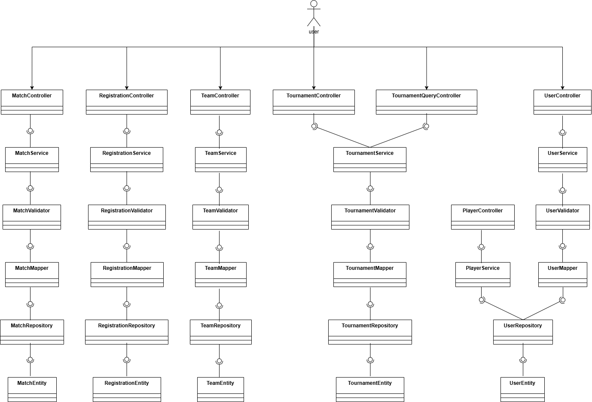

# Documento de Arquitectura

## 1. Descripción del Servicio

### 1.1 Descripción del Servicio
Zeus-Codensa es el servicio backend de la plataforma TechCup y actúa como núcleo de procesamiento del torneo. Su responsabilidad es recibir solicitudes desde clientes web o móviles, aplicar las reglas del negocio y devolver respuestas estandarizadas a través de una API REST.

El servicio cubre el flujo operativo principal del campeonato: autenticación de usuarios, gestión de perfiles, administración de equipos y jugadores, creación y consulta de torneos, proceso de inscripción y gestión de partidos. De esta forma, concentra en un solo punto la lógica funcional y evita que las reglas críticas queden distribuidas en varios clientes.

Arquitectónicamente, Zeus-Codensa separa presentación, negocio y persistencia para mejorar mantenibilidad, trazabilidad y escalabilidad. Esta organización permite evolucionar funcionalidades de forma controlada, reforzar validaciones y mantener un manejo uniforme de errores y respuestas en todo el sistema.

### 1.2 Diagrama de contexto

El diagrama de contexto presenta a Zeus-Codensa como sistema central y su relación con actores externos. Permite delimitar el alcance del servicio y visualizar los flujos principales de entrada (solicitudes) y salida (respuestas y errores), sin entrar al detalle interno de implementación.


 
En el contexto definido se identifican cinco actores principales: Estudiante, Capitán, Árbitro, Administrador y Organizador. El servicio también interactúa con dos sistemas externos: Correo Institucional (autenticación) y NEQUI/Efectivo (validación de comprobantes de pago).

Las interacciones mostradas en el diagrama son:
- Estudiante: registrarse.
- Capitán: gestionar alineación, invitaciones y pagos.
- Árbitro: consultar partidos asignados.
- Administrador: gestión del sistema, usuarios, roles y auditoría.
- Organizador: registrar partidos.

Adicionalmente, el diagrama explicita reglas de negocio del torneo: mínimo y máximo de jugadores por equipo, restricción de un jugador por equipo, distribución de programas académicos por equipo, número de jugadores por partido, estados del pago (pendiente, en revisión, aprobado, rechazado) y bloqueo de cambios de equipo después de iniciar el torneo.

## 2. Tecnologías a Usar

### 2.1 Tecnologías del servicio
- Lenguaje: Java 21.
- Framework principal: Spring Boot 3.3.4.
- Frameworks y módulos: Spring Web, Spring Security, Spring Data JPA.
- Base de datos: PostgreSQL.
- Autenticación y autorización: JWT (JJWT).
- Documentación API: Springdoc OpenAPI (Swagger UI).
- Validación de datos: Jakarta Validation API.
- Testing: JUnit 5 y Mockito.
- Cobertura de pruebas: JaCoCo.
- Herramienta de construcción y dependencias: Maven.

### 2.2 Justificación por tecnología
- Java 21: proporciona rendimiento estable, tipado fuerte y compatibilidad con el ecosistema empresarial de Spring.
- Spring Boot 3.3.4: acelera la construcción de servicios REST mediante autoconfiguración y convenciones de desarrollo.
- Spring Web: facilita la exposición de endpoints HTTP con estructura clara de controladores y respuestas.
- Spring Security: permite aplicar control de acceso por autenticación/autorización de forma centralizada.
- Spring Data JPA: simplifica el acceso a datos y reduce código repetitivo en repositorios.
- PostgreSQL: ofrece consistencia transaccional, integridad relacional y buen desempeño para datos estructurados del torneo.
- JWT (JJWT): habilita autenticación stateless para proteger endpoints y manejar sesiones de forma segura.
- Springdoc OpenAPI (Swagger UI): genera documentación interactiva de la API y mejora la trazabilidad de contratos.
- Jakarta Validation API: asegura validación de campos de entrada antes de ejecutar lógica de negocio.
- JUnit 5 y Mockito: permiten pruebas unitarias y de integración con aislamiento de dependencias.
- JaCoCo: mide cobertura de pruebas para identificar módulos críticos sin validación suficiente.
- Maven: gestiona dependencias, ciclos de build y ejecución estandarizada del proyecto.

## 3. Funcionalidades

### 3.1 Funcionalidades identificadas
- Registro e inicio de sesión de usuarios.
- Gestión de usuarios y roles.
- Creación y administración de equipos.
- Gestión de jugadores por equipo.
- Creación, configuración y consulta de torneos.
- Proceso de inscripción de equipos al torneo.
- Registro y actualización de partidos.
- Consulta de partidos asignados.
- Gestión de alineaciones.
- Control disciplinario (tarjetas y sanciones).
- Validación de comprobantes de pago.
- Auditoría y administración general del sistema.

### 3.2 Casos de uso

El siguiente diagrama ilustra los principales casos de uso identificados en el sistema, mostrando la interacción entre los actores (Estudiante, Capitán, Árbitro, Administrador, Organizador) y las funcionalidades que cada uno puede ejecutar dentro de Zeus-Codensa.


- CU-01 Registrar usuario (Actor: Estudiante).
- CU-02 Autenticar usuario con correo institucional (Actor: Estudiante, Capitán, Árbitro, Administrador, Organizador).
- CU-03 Crear y administrar equipo (Actor: Capitán).
- CU-04 Gestionar jugadores de equipo (Actor: Capitán).
- CU-05 Registrar inscripción y pago de equipo (Actor: Capitán).
- CU-06 Validar comprobante y estado de inscripción (Actor: Administrador/Organizador).
- CU-07 Crear y gestionar torneos (Actor: Organizador).
- CU-08 Registrar partidos y resultados (Actor: Organizador).
- CU-09 Consultar partidos asignados (Actor: Árbitro).
- CU-10 Gestionar usuarios, roles y auditoría (Actor: Administrador).

## 4. Diagrama de Base de Datos

### 4.1 Descripción General
La base de datos de Zeus-Codensa está diseñada en PostgreSQL con un modelo relacional que garantiza integridad de datos, consistencia transaccional y escalabilidad. El diseño separa claramente las entidades del negocio en tablas normalizadas con relaciones bien definidas que permiten consultas eficientes y mantenibilidad a largo plazo.

### 4.2 Diagrama de Base de Datos y Explicación - Tablas/Documentos Utilizados

El diagrama de base de datos representa el modelo relacional de Zeus-Codensa, mostrando todas las tablas, sus atributos principales, tipos de datos y las relaciones entre entidades. Este modelo permite gestionar de forma integrada usuarios, equipos, torneos, partidos e inscripciones con garantías de consistencia e integridad referencial.


#### Tablas Principales y Atributos

**users** (Tabla base de usuarios)
- `id` (BIGINT, PK): Identificador único del usuario
- `name` (VARCHAR): Nombre completo del usuario
- `email` (VARCHAR, UNIQUE): Correo electrónico único para autenticación e identificación
- `password` (VARCHAR): Contraseña encriptada del usuario
- `photo` (VARCHAR): URL o ruta de foto de perfil
- `role` (VARCHAR): Rol del usuario (Estudiante, Capitán, Árbitro, Administrador, Organizador)
- `type` (VARCHAR): Clasificación adicional si aplica
- `position` (VARCHAR): Posición en campo (relevante para jugadores)
- `jerseyNumber` (INT): Número de dorsal del usuario

**teams** (Tabla de equipos)
- `id` (BIGINT, PK): Identificador único del equipo
- `teamName` (VARCHAR, UNIQUE): Nombre del equipo
- `escudo` (VARCHAR): Logo o escudo del equipo
- `coloresUniforme` (VARCHAR): Colores representativos del equipo
- Relación: un equipo tiene múltiples jugadores a través de `team_players`

**team_players** (Tabla de relación muchos-a-muchos)
- `team_id` (BIGINT, FK): Referencia a tabla teams
- `user_id` (BIGINT, FK): Referencia a tabla users
- Permite que un usuario sea jugador de un equipo; trackea la membresía

**invitations** (Tabla de invitaciones)
- `id` (VARCHAR, PK): Identificador único de invitación
- `captainEmail` (VARCHAR): Email del capitán que invita
- `playerEmail` (VARCHAR): Email del jugador invitado
- `teamName` (VARCHAR): Nombre del equipo al que se invita
- `status` (VARCHAR): Estado de la invitación
- Relación: conecta usuarios (capitán e invitado) con equipos

**registrations** (Tabla de inscripciones de torneos)
- `id` (VARCHAR, PK): Identificador único de inscripción
- `teamName` (VARCHAR): Nombre del equipo inscrito
- `tournamentName` (VARCHAR): Nombre del torneo
- `status` (VARCHAR): Estado de inscripción (pendiente, aprobado, rechazado)
- `comprobantePagoUrl` (VARCHAR): URL del comprobante de pago
- `fechaInscripcion` (VARCHAR): Fecha de la inscripción
- Relación: vincula equipos con torneos y tracking de pagos

**tournaments** (Tabla de torneos)
- `id` (VARCHAR, PK): Identificador único del torneo
- `tournamentName` (VARCHAR, UNIQUE): Nombre del torneo
- `fechaInicio` (VARCHAR): Fecha de inicio del campeonato
- `fechaFin` (VARCHAR): Fecha de finalización del campeonato
- `numeroEquipos` (INT): Cantidad de equipos participantes
- `costoInscripcion` (DOUBLE): Costo de inscripción por equipo
- `status` (VARCHAR): Estado del torneo
- `rules` (VARCHAR): Reglamento o normas del torneo
- `fechaCierreInscripciones` (VARCHAR): Fecha límite para inscribirse
- `fechaInicioFaseGrupos` (VARCHAR): Inicio de fase de grupos
- `sanctions` (VARCHAR): Sanciones o restricciones del torneo
- `campeon` (VARCHAR): Equipo campeón (se llena al finalizar)
- Relaciones: tiene muchos matches, muchas registrations, tiene horarios y canchas

**tournament_horarios** (Tabla de horarios disponibles)
- `tournament_id` (VARCHAR, FK): Referencia a tabla tournaments
- `horario` (VARCHAR): Hora del partido (ej: 10:00 AM)
- Permite configurar múltiples franjas horarias por torneo

**tournament_canchas** (Tabla de canchas disponibles)
- `tournament_id` (VARCHAR, FK): Referencia a tabla tournaments
- `cancha` (VARCHAR): Nombre o identificador de la cancha
- Permite configurar múltiples canchas disponibles por torneo

**matches** (Tabla de partidos)
- `id` (VARCHAR, PK): Identificador único del partido
- `homeTeam` (VARCHAR): Equipo local que juega en casa
- `awayTeam` (VARCHAR): Equipo visitante
- `matchDate` (VARCHAR): Fecha del partido
- `homeScore` (INT): Goles del equipo local
- `awayScore` (INT): Goles del equipo visitante
- `status` (VARCHAR): Estado del partido (programado, en juego, finalizado)
- `tournamentName` (VARCHAR): Torneo al que pertenece el partido
- `refereeEmail` (VARCHAR): Email del árbitro asignado
- `alineacionesJson` (TEXT): JSON con alineaciones de ambos equipos
- `goalsJson` (TEXT): JSON con detalle de goles
- `yellowCardsJson` (TEXT): JSON con tarjetas amarillas
- `redCardsJson` (TEXT): JSON con tarjetas rojas
- Relación: cada partido pertenece a un torneo y tiene árbitro asignado

#### Relaciones Funcionales

| Relación | Tipo | Descripción |
|----------|------|------------|
| users → team_players → teams | N:M | Un usuario puede jugar en un equipo; un equipo tiene múltiples jugadores |
| teams → registrations | 1:N | Un equipo puede inscribirse a múltiples torneos |
| tournaments → registrations | 1:N | Un torneo recibe múltiples inscripciones de equipos |
| tournaments → matches | 1:N | Un torneo contiene múltiples partidos |
| tournaments → tournament_horarios | 1:N | Un torneo tiene múltiples horarios disponibles |
| tournaments → tournament_canchas | 1:N | Un torneo tiene múltiples canchas disponibles |
| users → invitations | 1:N |Un capitán envía múltiples invitaciones a jugadores |
| matches → teams | N:N | Los partidos enfrentan dos equipos (local y visitante) |

---

## 5. Diagrama de Clases

### 5.1 Descripción General
El diagrama de clases de Zeus-Codensa refleja la arquitectura de tres capas del sistema: presentación (controladores), capa de negocio (modelos y servicios) y persistencia (entidades y repositorios). Las clases están organizadas siguiendo principios de separación de responsabilidades, herencia (polimorfismo de usuarios) y patrones de diseño como Factory y Strategy.

### 5.2 Diagrama de Clases del Sistema

A continuación se presenta el diagrama de clases que ilustra la estructura de los modelos del dominio, organizados por capas (presentación, lógica de negocio y persistencia), mostrando las entidades principales y sus relaciones.


El diagrama muestra la arquitectura en tres capas:

- **Controllers** (`AuthController`, `UserController`, `TeamController`, `TournamentController`, `MatchController`): Reciben solicitudes HTTP y delegan a servicios.
- **Services** (`AuthService`, `UserService`, `TeamService`, `TournamentService`, `MatchService`): Contienen la lógica de negocio y orquestan operaciones.
- **Repositories & Entities**: Abstraen el acceso a datos mediante Spring Data JPA.

**Clases principales**: `User` (base para Player, Captain, Referee, Administrator, Organizer), `Team`, `Tournament`, `Match`, `Registration`, `Invitation`.

**Flujo**: Controller → DTO → Mapper → Service → Repository → Base de datos.

### 5.3 Patrones de Diseño Implementados

El sistema aplica patrones profesionales que facilitan mantenimiento y escalabilidad:

#### **1. Factory Method**
**Ubicación**: `core.factory.UserFactory`

Centraliza la creación de diferentes tipos de usuarios (Player, Captain, Administrator, Referee, Organizer) en una única clase. En lugar de instanciar directamente cada tipo en los controladores, todas las creaciones pasan por la factory que encapsula la lógica de inicialización específica para cada rol. Esto permite agregar nuevos tipos de usuarios sin modificar el código cliente y facilita aplicar reglas de validación comunes durante la creación.

#### **2. Strategy Pattern**
**Ubicación**: `core.service.strategy.BracketGenerationStrategy` (interfaz) e `core.service.strategy.RandomDrawStrategy` (implementación)

Define diferentes algoritmos para generar brackets de torneos sin cambiar el código que los utiliza. La interfaz establece el contrato, y cada implementación (actualmente `RandomDrawStrategy`) proporciona un algoritmo específico. Un torneo puede seleccionar su estrategia en tiempo de ejecución. Esto permite agregar nuevos algoritmos de emparejamiento (balanceado, por seeding, etc.) sin alterar el flujo principal del torneo.

#### **3. Mapper Pattern**
**Ubicación**: `dependencies.mapper.UserMapper` (y mappers adicionales)

Transforma datos entre DTOs (formato de solicitud/respuesta HTTP) y entidades de dominio (modelos internos). Desacopla completamente la estructura que ve el cliente de la estructura interna del sistema. Permite evolucionar la base de datos y los servicios sin afectar la API REST, y proporciona seguridad exponiendo solo los campos necesarios.

#### **4. DTO Pattern (Data Transfer Object)**
**Ubicación**: `dependencies.dto.*` (UserRequestDTO, LoginResponseDTO, UserResponseDTO, etc.)

Define contratos explícitos para peticiones y respuestas con validaciones declarativas usando Jakarta Validation (`@NotNull`, `@Email`, `@Size`, etc.). Cada DTO especifica exactamente qué campos se esperan o se devuelven. Centraliza la validación en un solo lugar antes de procesar datos, mejora la documentación de la API, y aísla cambios en la presentación de cambios en la lógica de negocio.

#### **5. Dependency Injection (DI)**
**Ubicación**: `core.service.*` (todas las clases de servicio) y `controller.*` (controladores)

Spring gestiona automáticamente la inyección de dependencias mediante el contenedor IoC. Los controladores reciben sus servicios inyectados, y los servicios reciben sus repositorios sin crear instancias manualmente. Reduce el acoplamiento permitiendo cambiar implementaciones (ej: pasar de base de datos real a mock en pruebas), mejora testabilidad, y centraliza la gestión del ciclo de vida de componentes.

#### **6. Repository Pattern**
**Ubicación**: `dependencies.persistence.repository.*` (UserRepository, TeamRepository, TournamentRepository, MatchRepository, etc.)

Abstrae completamente la lógica de acceso a datos. Cada repositorio hereda de Spring Data JPA proporcionando operaciones estándar (CRUD, búsquedas) sin escribir SQL. Los servicios trabajan solo con los repositorios, nunca directamente con la base de datos. Permite cambiar la estrategia de persistencia (cambiar de PostgreSQL a otra BD) sin afectar los servicios.

#### **7. Exception Handling Pattern**
**Ubicación**: `core.exception.GlobalExceptionHandler` (manejador centralizado) con excepciones personalizadas (`BusinessRuleException`, `ResourceNotFoundException`, `PersistenceAccessException`)

Centraliza el manejo de todos los errores en un único componente con anotación `@RestControllerAdvice`. Define excepciones específicas para distintos escenarios, cada una convertida automáticamente a la respuesta HTTP apropiada. Garantiza respuestas de error uniformes, facilita logging y auditoría centralizada, e informa al cliente exactamente qué sucedió.

#### **8. Singleton Pattern**
**Ubicación**: Componentes de Spring (todos los servicios y controladores)

Spring gestiona automáticamente los componentes como instancias únicas mediante el contenedor IoC. Cada servicio, controlador o repositorio existe en una sola copia compartida por toda la aplicación. Optimiza memoria, garantiza comportamiento consistente, y simplifica el estado compartido entre capas.

---

## 6. Diagrama de Componentes del Servicio

### 6.1 Diagrama de Componentes General

El diagrama general muestra la arquitectura de alto nivel del sistema, representando la interacción entre el usuario, el cliente (frontend), el backend Zeus-Codensa y la base de datos PostgreSQL como componentes principales.


```
Usuario → Frontend (Web/Mobile) → Backend (Zeus-Codensa) → PostgreSQL
```

**Componentes:**
- **Usuario**: Actor que interactúa con el sistema (Estudiante, Capitán, Árbitro, Administrador, Organizador)
- **Frontend**: Aplicación web o móvil que consume la API REST de Zeus-Codensa
- **Backend (Zeus-Codensa)**: Servicio REST que procesa solicitudes, aplica reglas de negocio y devuelve respuestas
- **PostgreSQL**: Base de datos relacional que persiste todos los datos del torneo

**Flujo de comunicación**: El usuario interactúa con el frontend, que envía peticiones HTTP al backend. El backend procesa la solicitud, consulta/modifica datos en la base de datos y devuelve una respuesta JSON al frontend.

### 6.2 Diagrama de Componentes Específico (Desglose del Backend)

Este diagrama detalla la arquitectura interna del backend Zeus-Codensa, mostrando las cadenas funcionales verticales de cada módulo (Match, Registration, Team, Tournament, User/Player) y los componentes transversales (seguridad, configuración, DTOs, mappers, persistencia) que soportan el sistema.



Este diagrama muestra la descomposición interna del backend Zeus-Codensa por cadenas funcionales verticales. Cada cadena sigue el mismo patrón arquitectónico desde la entrada del usuario hasta la persistencia en base de datos.

Flujo arquitectónico común:
- Usuario -> Controller: recibe la solicitud HTTP.
- Controller -> Service: delega la ejecución del caso de uso.
- Service -> Validator: valida reglas de negocio y restricciones de entrada.
- Validator -> Mapper: transforma datos entre DTOs y modelos de dominio.
- Mapper -> Repository: ejecuta operaciones de consulta o persistencia.
- Repository -> Entity: representa la estructura de datos persistida.

Módulos observados en el diagrama:
- Match: MatchController, MatchService, MatchValidator, MatchMapper, MatchRepository, MatchEntity.
- Registration: RegistrationController, RegistrationService, RegistrationValidator, RegistrationMapper, RegistrationRepository, RegistrationEntity.
- Team: TeamController, TeamService, TeamValidator, TeamMapper, TeamRepository, TeamEntity.
- Tournament: TournamentController y TournamentQueryController convergen en TournamentService, seguido por TournamentValidator, TournamentMapper, TournamentRepository y TournamentEntity.
- User/Player: UserController, UserService, UserValidator, UserMapper y UserRepository, con integración del flujo PlayerController/PlayerService hacia el repositorio de usuarios.

Uso de otros módulos (transversales al servicio):
- Seguridad y autenticación: `AuthController`, `ExternalAuthController` y componentes de `dependencies/security` gestionan login, validación de credenciales y control de acceso a endpoints.
- Configuración técnica: `dependencies/config` centraliza configuración de seguridad, persistencia y documentación del servicio.
- Contratos de integración: `dependencies/dto` define estructuras de request/response consumidas por los controladores.
- Mapeo entre capas: `dependencies/mapper` transforma DTOs a modelos de dominio y viceversa para desacoplar API y persistencia.
- Persistencia: `dependencies/persistence` contiene entidades, repositorios y lógica de acceso a datos para todos los módulos funcionales.
- Manejo global de errores: `core/exception/GlobalExceptionHandler` y excepciones personalizadas unifican respuestas de error entre módulos.

Interpretación técnica:
- La separación por capas reduce acoplamiento y facilita mantenimiento.
- La validación centralizada evita que reglas de negocio queden dispersas en controladores.
- El uso de mappers estandariza la transformación de datos entre API y persistencia.
- La convergencia de TournamentController y TournamentQueryController en TournamentService concentra la lógica de torneo en un único punto.


### 6.3 Funcionalidades Expuestas (Contratos API)

Esta sección detalla la información de request y response por funcionalidad, incluyendo tipos de datos, composición de objetos, uso de enumeraciones y restricciones aplicadas en validadores del dominio.

#### 6.3.1 Información de Request y Response

##### A) Gestión de Usuarios

- Request principal: `UserRequestDTO`
	- `name: String`
	- `email: String`
	- `password: String`
	- `position: String` (obligatorio para PLAYER/CAPTAIN)
	- `jerseyNumber: Integer` (obligatorio para PLAYER/CAPTAIN)
	- `photo: String`
	- `role: Role` (enumeración)
	- `userType: String` (mapeado a `UserType`)
- Response principal: `UserResponseDTO`
	- `name: String`, `email: String`, `photo: String`
	- `role: Role` (enumeración)
	- `userType: UserType` (enumeración)
	- `position: String`, `jerseyNumber: Integer` (si aplica)

Restricciones vigentes en validación (`UserValidator`):
- `name` obligatorio (no vacío).
- `email` obligatorio y con formato institucional: `nombre.apellido-a@escuelaing.edu.co`.
- `password` mínimo 6 caracteres.
- `role` obligatorio.
- Para roles PLAYER/CAPTAIN: `position` obligatoria y `jerseyNumber > 0`.
- `email` no duplicado.

##### B) Autenticación

- Request: `LoginRequestDTO`
	- `email: String`
	- `password: String`
- Response: `LoginResponseDTO`
	- `token: String` (JWT)
	- `user: UserResponseDTO` (objeto anidado)

Notas de estructura:
- La respuesta de login es un objeto compuesto (`token` + objeto `user`).

##### C) Gestión de Equipos

- Request: `TeamRequestDTO`
	- `teamName: String`
	- `escudo: String`
	- `coloresUniforme: String`
	- `playerEmails: List<String>` (colección)
- Response: `TeamResponseDTO`
	- `teamName: String`, `escudo: String`, `coloresUniforme: String`
	- `players: List<UserResponseDTO>` (colección de objetos)

Restricciones vigentes en validación (`TeamValidator`):
- `teamName` obligatorio y no duplicado.
- `playerEmails` con mínimo 7 y máximo 20 jugadores iniciales.
- Sin correos duplicados en la misma solicitud.
- Un jugador no puede pertenecer a más de un equipo.

##### D) Gestión de Torneos

- Request: `TournamentRequestDTO`
	- Básicos: `tournamentName: String`, `fechaInicio: String`, `fechaFin: String`, `numeroEquipos: Integer`, `costoInscripcion: Double`
	- Configuración avanzada: `rules: String`, `fechaCierreInscripciones: String`, `fechaInicioFaseGrupos: String`, `horariosPartidos: List<String>`, `canchas: List<String>`, `sanctions: String`
- Response: `TournamentResponseDTO`
	- `id: String`, campos básicos, `status: String`
	- Campos avanzados equivalentes a request

Restricciones vigentes en validación (`TournamentValidator`):
- `tournamentName` obligatorio y no duplicado.
- `numeroEquipos >= 2`.
- `costoInscripcion >= 0`.

##### E) Inscripciones

- Request: `RegistrationRequestDTO`
	- `teamName: String`
	- `tournamentName: String`
	- `comprobantePagoUrl: String`
- Response: `RegistrationResponseDTO`
	- `id: String`, `teamName: String`, `tournamentName: String`, `status: String`, `comprobantePagoUrl: String`, `fechaInscripcion: String`

Restricciones vigentes en validación (`RegistrationValidator`):
- `teamName`, `tournamentName` y `comprobantePagoUrl` obligatorios.
- El equipo debe existir.
- El torneo debe existir y estar en estado `OPEN`.
- No se permite inscripción duplicada del mismo equipo al mismo torneo.

##### F) Partidos

- Request: `MatchRequestDTO`
	- `homeTeam: String`
	- `awayTeam: String`
	- `matchDate: String`
	- `tournamentName: String`
- Response: `MatchResponseDTO`
	- Básicos: `id: String`, `homeTeam: String`, `awayTeam: String`, `matchDate: String`, `homeScore: Integer`, `awayScore: Integer`, `status: String`, `tournamentName: String`, `refereeEmail: String`
	- Objetos/colecciones: `alineaciones: Map<String, List<String>>`, `yellowCards: Map<String, List<String>>`, `redCards: Map<String, List<String>>`

Restricciones vigentes en validación (`MatchValidator`):
- `homeTeam` y `awayTeam` obligatorios y distintos.
- `tournamentName` y `matchDate` obligatorios.
- El torneo debe existir.
- Ambos equipos deben estar inscritos y aprobados (`APPROVED`) en el torneo.

##### G) Invitaciones

- Request: `InvitationRequestDTO`
	- `captainEmail: String`
	- `playerEmail: String`
	- `teamName: String`
- Response: `InvitationResponseDTO`
	- `id: String`, `playerEmail: String`, `teamName: String`, `status: String`, `message: String`

#### 6.3.2 Manejo de Errores

El servicio utiliza `GlobalExceptionHandler` para estandarizar respuestas de error con `ApiErrorDTO`.

Estructura de error (`ApiErrorDTO`):
- `timestamp: LocalDateTime`
- `status: int`
- `error: String`
- `message: String`
- `path: String`

Códigos utilizados y escenarios:

- **400 Bad Request**
	- Escenario: violación de reglas de negocio (`BusinessRuleException`) o argumentos inválidos (`IllegalArgumentException`).
	- Ejemplos de mensaje por escenario:
		- "Ya existe un usuario con ese correo"
		- "El correo debe ser institucional (ej. nombre.apellido-a@escuelaing.edu.co)"
		- "Un team debe tener entre 7 y 20 players inscritos inicialmente"
		- "Los teams deben estar inscritos y APPROVED en el tournament"

- **404 Not Found**
	- Escenario: recurso no encontrado (`ResourceNotFoundException`).
	- Ejemplo de mensaje: recurso/torneo/equipo no encontrado según contexto del caso de uso.

- **503 Service Unavailable**
	- Escenario: error de acceso a persistencia (`PersistenceAccessException`).
	- Ejemplo de mensaje:
		- "Error al persistir el usuario en base de datos"
		- "Error al consultar usuarios en base de datos"

- **500 Internal Server Error**
	- Escenario: excepción no controlada (`Exception`).
	- Mensaje: detalle de excepción propagado por el manejador global.

Observaciones de contrato:
- Las restricciones de longitud explícitas implementadas actualmente son mínimas; la principal es `password` con longitud mínima de 6.
- Otras restricciones relevantes se definen por reglas de negocio (rangos, unicidad, estados permitidos y formato de email).

---

## 7. Diagramas de Secuencia de las Funcionalidades

Esta sección presenta los diagramas de secuencia de las funcionalidades principales del sistema y su explicación operativa. En todos los diagramas se mantiene un patrón común: Cliente -> Controller -> Service -> Validator/Mapper -> Repository, con validación de token JWT para endpoints protegidos.

### 7.1 Función 1 - Login (Flujo de Autenticación)

Este diagrama de secuencia muestra el flujo completo de autenticación de un usuario: validación de credenciales, consulta en base de datos, generación de token JWT y respuesta al cliente.


Explicación:
- El cliente envía credenciales al endpoint de autenticación.
- El servicio valida formato y presencia de correo/contraseña.
- Se consulta el usuario por correo y se verifica la contraseña.
- Si las credenciales son válidas, se genera JWT y se retorna LoginResponseDTO.
- Errores contemplados: 400 (credenciales inválidas), 401 (token inválido/expirado en llamadas protegidas).

### 7.2 Función 2 - Registro de Usuario

Muestra el flujo de registro de un nuevo usuario: validación de datos, verificación de unicidad de correo, persistencia en base de datos y respuesta con datos del usuario registrado.


Explicación:
- El cliente envía UserRequestDTO para creación de usuario.
- Se ejecutan validaciones de reglas de negocio (rol, email institucional, campos obligatorios).
- Se transforma DTO a modelo y se persiste en repositorio.
- Se responde con UserResponseDTO.
- Errores contemplados: 400 (datos inválidos), 409/400 lógica de duplicidad de correo.

### 7.3 Función 3 - Consulta de Usuarios

Ilustra el proceso de consulta de la lista de usuarios: validación de autenticación, obtención de datos del repositorio, mapeo a DTOs y retorno de colección de usuarios.


Explicación:
- Se valida token JWT antes de procesar la consulta.
- El servicio solicita la lista al repositorio.
- El resultado se transforma a lista de UserResponseDTO.
- Se retorna 200 con la colección de usuarios.
- Errores contemplados: 401 (no autenticado), 500 (fallo no esperado).

### 7.4 Función 4 - Creación de Equipo

Presenta el flujo de creación de un equipo: validación de nombre y cantidad de jugadores, verificación de no duplicidad, transformación de DTO a modelo y persistencia.


Explicación:
- El cliente envía TeamRequestDTO.
- Se validan nombre de equipo, cantidad de jugadores y no duplicidad.
- Se validan correos de jugadores y pertenencia a otros equipos.
- Se transforma a entidad/modelo y se persiste.
- Se retorna TeamResponseDTO.

### 7.5 Función 5 - Consulta de Equipos

Muestra el flujo de consulta de equipos: validación de autenticación, obtención de lista del repositorio, mapeo a DTOs de respuesta y retorno de colección de equipos.


Explicación:
- Se valida autenticación con JWT.
- El servicio obtiene la lista de equipos del repositorio.
- Se mapea la lista a TeamResponseDTO.
- Se responde 200 con la colección.
- Escenarios alternos: 204 sin contenido o 500 por error interno.

### 7.6 Función 6 - Creación de Torneo

Ilustra el flujo de creación de un torneo: validación de datos base (nombre, número de equipos, costo), transformación a modelo y persistencia en repositorio.


Explicación:
- El cliente envía TournamentRequestDTO con datos base del torneo.
- Se validan reglas mínimas (nombre, número de equipos, costo).
- Se transforma y persiste en repositorio.
- Se retorna TournamentResponseDTO con estado inicial.
- Errores contemplados: 400 por validaciones o duplicidad.

### 7.7 Función 7 - Configuración de Torneo

Presenta el flujo de configuración avanzada de un torneo: recepción de reglamento, horarios, canchas y sanciones; validación de consistencia y actualización persistida.


Explicación:
- El cliente envía configuración avanzada del torneo (reglas, horarios, canchas, sanciones).
- El servicio consulta torneo existente y valida consistencia de campos.
- Se actualiza el torneo y se persiste el nuevo estado.
- Se retorna TournamentResponseDTO actualizado.
- Escenarios alternos: 404 si torneo no existe, 400 por formato/reglas inválidas.

### 7.8 Función 8 - Consulta de Torneos

Muestra el flujo de consulta de torneos: validación de JWT, obtención de lista del repositorio, mapeo a DTOs de respuesta y envío de colección de torneos.


Explicación:
- Se valida JWT para acceso al endpoint.
- Se consulta listado de torneos en repositorio.
- Se transforma cada registro a TournamentResponseDTO.
- Se responde lista agregada al cliente.

### 7.9 Función 9 - Creación de Inscripción

Ilustra el flujo de inscripción de equipo a torneo: validación de existencia de equipo y torneo, verificación de no duplicidad, y persistencia de registro de inscripción.


Explicación:
- El cliente envía RegistrationRequestDTO.
- Se validan: existencia de equipo, torneo OPEN, y no duplicidad de inscripción.
- Se registra la inscripción con estado inicial.
- Se responde RegistrationResponseDTO.
- Errores: 400 por regla de negocio, 404 en recursos no encontrados.

### 7.10 Función 10 - Actualización de Estado de Inscripción

Presenta el flujo de cambio de estado de una inscripción: validación de autorización, verificación de transiciones válidas entre estados (PENDIENTE, EN_REVISIÓN, APROBADO, RECHAZADO) y actualización persistida.


Explicación:
- Se valida autenticación/autorización del actor que actualiza estado.
- Se busca la inscripción por id y se valida transición de estado.
- Estados manejados en el flujo: PENDIENTE, EN_REVISION, APROBADO, RECHAZADO.
- Se persiste el nuevo estado y se retorna la inscripción actualizada.

### 7.11 Función 11 - Consulta de Inscripciones

Muestra el flujo de consulta de inscripciones: validación de JWT, obtención de lista filtrada del repositorio, mapeo a DTOs de respuesta y retorno de colección.


Explicación:
- Se valida JWT.
- El servicio consulta inscripciones por criterio y obtiene lista.
- Se transforma cada resultado a RegistrationResponseDTO.
- Se retorna lista o respuesta vacía según el resultado.

### 7.12 Función 12 - Creación de Partido

Ilustra el flujo de creación de un partido: validación de equipos, torneo y elegibilidad; transformación de DTO a modelo y persistencia en repositorio.


Explicación:
- El cliente envía MatchRequestDTO.
- Se validan equipos, torneo y elegibilidad para jugar.
- Se mapea el DTO a modelo de partido y se persiste.
- Se responde MatchResponseDTO.
- Errores: 400 por datos inválidos o reglas no cumplidas.

### 7.13 Función 13 - Actualización de Marcador

Presenta el flujo de actualización de marcador de un partido: validación de autorización y estado del partido, actualización de goles y persistencia de cambios.


Explicación:
- Se valida JWT y permisos del actor.
- Se localiza el partido y se valida que esté en estado actualizable.
- Se actualizan goles/marcador y se persiste.
- Se devuelve MatchResponseDTO actualizado.

### 7.14 Función 14 - Registro de Alineación

Muestra el flujo de registro de alineación: validación de autenticación, verificación de jugadores y su participación en el partido, validación de cantidad permitida y persistencia.


Explicación:
- Se valida token y autorización.
- Se verifica existencia del partido y de los jugadores reportados.
- Se valida cantidad permitida de jugadores y consistencia de equipo.
- Se guarda alineación y se retorna partido actualizado.

### 7.15 Función 15 - Registro de Tarjetas

Ilustra el flujo de registro de tarjetas (amarillas/rojas): validación de permisos, verificación de tipo de tarjeta y jugador objetivo, validación de participación y actualización persistida.


Explicación:
- Se valida JWT y permisos de registro.
- Se valida tipo de tarjeta y jugador objetivo.
- Se verifica que el jugador participe en el partido.
- Se actualizan tarjetas amarillas/rojas y se persiste.
- Se responde con MatchResponseDTO actualizado.

---

## 8. Bibliografía

### 8.1 Fuentes técnicas
- Spring. (2026). *Spring Boot Reference Documentation*. https://docs.spring.io/spring-boot/docs/current/reference/html/
- Spring. (2026). *Spring Security Reference*. https://docs.spring.io/spring-security/reference/
- Jakarta EE. (2026). *Jakarta Bean Validation*. https://jakarta.ee/specifications/bean-validation/
- PostgreSQL Global Development Group. (2026). *PostgreSQL Documentation*. https://www.postgresql.org/docs/
- OpenAPI Initiative. (2026). *OpenAPI Specification*. https://spec.openapis.org/oas/latest.html
- Swagger. (2026). *Swagger Documentation*. https://swagger.io/docs/
- JSON Web Token (JWT). (2026). *RFC 7519*. https://www.rfc-editor.org/rfc/rfc7519
- Apache Maven Project. (2026). *Maven Documentation*. https://maven.apache.org/guides/
- JUnit 5. (2026). *User Guide*. https://junit.org/junit5/docs/current/user-guide/
- Mockito. (2026). *Mockito Documentation*. https://javadoc.io/doc/org.mockito/mockito-core/latest/org/mockito/Mockito.html

### 8.2 Herramientas de apoyo (IA y productividad)
- OpenAI. (2026). *ChatGPT*. https://chat.openai.com/ (consultado el 30 de marzo de 2026).
- GitHub. (2026). *GitHub Copilot*. https://github.com/features/copilot (consultado el 30 de marzo de 2026).
- Microsoft. (2026). *Visual Studio Code*. https://code.visualstudio.com/ (consultado el 30 de marzo de 2026).
- diagrams.net. (2026). *draw.io*. https://www.diagrams.net/ (consultado el 30 de marzo de 2026).


