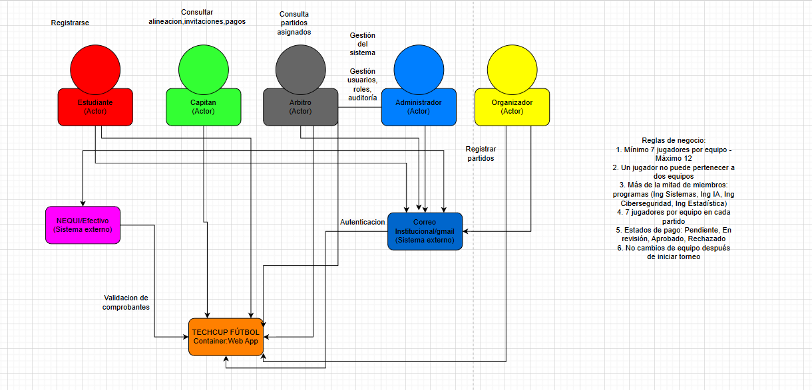

# Documento de Arquitectura

## 1. Descripción del Servicio

### 1.1 Descripción del Servicio
Zeus-Codensa es el servicio backend de la plataforma TechCup y actúa como núcleo de procesamiento del torneo. Su responsabilidad es recibir solicitudes desde clientes web o móviles, aplicar las reglas del negocio y devolver respuestas estandarizadas a través de una API REST.

El servicio cubre el flujo operativo principal del campeonato: autenticación de usuarios, gestión de perfiles, administración de equipos y jugadores, creación y consulta de torneos, proceso de inscripción y gestión de partidos. De esta forma, concentra en un solo punto la lógica funcional y evita que las reglas críticas queden distribuidas en varios clientes.

Arquitectónicamente, Zeus-Codensa separa presentación, negocio y persistencia para mejorar mantenibilidad, trazabilidad y escalabilidad. Esta organización permite evolucionar funcionalidades de forma controlada, reforzar validaciones y mantener un manejo uniforme de errores y respuestas en todo el sistema.

### 1.2 Diagrama de contexto

El diagrama de contexto presenta a Zeus-Codensa como sistema central y su relación con actores externos. Permite delimitar el alcance del servicio y visualizar los flujos principales de entrada (solicitudes) y salida (respuestas y errores), sin entrar al detalle interno de implementación.

En el contexto definido se identifican cinco actores principales: Estudiante, Capitán, Árbitro, Administrador y Organizador. El servicio también interactúa con dos sistemas externos: Correo Institucional (autenticación) y NEQUI/Efectivo (validación de comprobantes de pago).

Las interacciones mostradas en el diagrama son:
- Estudiante: registrarse.
- Capitán: gestionar alineación, invitaciones y pagos.
- Árbitro: consultar partidos asignados.
- Administrador: gestión del sistema, usuarios, roles y auditoría.
- Organizador: registrar partidos.

Adicionalmente, el diagrama explicita reglas de negocio del torneo: mínimo y máximo de jugadores por equipo, restricción de un jugador por equipo, distribución de programas académicos por equipo, número de jugadores por partido, estados del pago (pendiente, en revisión, aprobado, rechazado) y bloqueo de cambios de equipo después de iniciar el torneo.

## 2. Tecnologías a Usar

### 2.1 Tecnologías del servicio
- Lenguaje: Java 21.
- Framework principal: Spring Boot 3.3.4.
- Frameworks y módulos: Spring Web, Spring Security, Spring Data JPA.
- Base de datos: PostgreSQL.
- Autenticación y autorización: JWT (JJWT).
- Documentación API: Springdoc OpenAPI (Swagger UI).
- Validación de datos: Jakarta Validation API.
- Testing: JUnit 5 y Mockito.
- Cobertura de pruebas: JaCoCo.
- Herramienta de construcción y dependencias: Maven.

### 2.2 Justificación por tecnología
- Java 21: proporciona rendimiento estable, tipado fuerte y compatibilidad con el ecosistema empresarial de Spring.
- Spring Boot 3.3.4: acelera la construcción de servicios REST mediante autoconfiguración y convenciones de desarrollo.
- Spring Web: facilita la exposición de endpoints HTTP con estructura clara de controladores y respuestas.
- Spring Security: permite aplicar control de acceso por autenticación/autorización de forma centralizada.
- Spring Data JPA: simplifica el acceso a datos y reduce código repetitivo en repositorios.
- PostgreSQL: ofrece consistencia transaccional, integridad relacional y buen desempeño para datos estructurados del torneo.
- JWT (JJWT): habilita autenticación stateless para proteger endpoints y manejar sesiones de forma segura.
- Springdoc OpenAPI (Swagger UI): genera documentación interactiva de la API y mejora la trazabilidad de contratos.
- Jakarta Validation API: asegura validación de campos de entrada antes de ejecutar lógica de negocio.
- JUnit 5 y Mockito: permiten pruebas unitarias y de integración con aislamiento de dependencias.
- JaCoCo: mide cobertura de pruebas para identificar módulos críticos sin validación suficiente.
- Maven: gestiona dependencias, ciclos de build y ejecución estandarizada del proyecto.

## 3. Funcionalidades

### 3.1 Funcionalidades identificadas
- Registro e inicio de sesión de usuarios.
- Gestión de usuarios y roles.
- Creación y administración de equipos.
- Gestión de jugadores por equipo.
- Creación, configuración y consulta de torneos.
- Proceso de inscripción de equipos al torneo.
- Registro y actualización de partidos.
- Consulta de partidos asignados.
- Gestión de alineaciones.
- Control disciplinario (tarjetas y sanciones).
- Validación de comprobantes de pago.
- Auditoría y administración general del sistema.

### 3.2 Casos de uso

- CU-01 Registrar usuario (Actor: Estudiante).
- CU-02 Autenticar usuario con correo institucional (Actor: Estudiante, Capitán, Árbitro, Administrador, Organizador).
- CU-03 Crear y administrar equipo (Actor: Capitán).
- CU-04 Gestionar jugadores de equipo (Actor: Capitán).
- CU-05 Registrar inscripción y pago de equipo (Actor: Capitán).
- CU-06 Validar comprobante y estado de inscripción (Actor: Administrador/Organizador).
- CU-07 Crear y gestionar torneos (Actor: Organizador).
- CU-08 Registrar partidos y resultados (Actor: Organizador).
- CU-09 Consultar partidos asignados (Actor: Árbitro).
- CU-10 Gestionar usuarios, roles y auditoría (Actor: Administrador).

## 4. Diagrama de Base de Datos

### 4.1 Descripción General
La base de datos de Zeus-Codensa está diseñada en PostgreSQL con un modelo relacional que garantiza integridad de datos, consistencia transaccional y escalabilidad. El diseño separa claramente las entidades del negocio en tablas normalizadas con relaciones bien definidas que permiten consultas eficientes y mantenibilidad a largo plazo.

### 4.2 Tablas/Documentos Utilizados

> **Estado**: Por implementar en la base de datos PostgreSQL.
>
> Se documentarán las siguientes tablas principales:
> - **users**: Información de usuarios (Estudiantes, Capitanes, Árbitros, Administradores, Organizadores)
> - **teams**: Equipos registrados con identidad visual
> - **team_players**: Relación muchos-a-muchos entre equipos y jugadores
> - **tournaments**: Configuración y estado de torneos
> - **tournament_horarios** y **tournament_canchas**: Colecciones de horarios y canchas
> - **matches**: Partidos programados con puntuaciones y disciplina
> - **registrations**: Inscripción de equipos a torneos
> - **invitations**: Invitaciones de jugadores a equipos

---

## 5. Diagrama de Clases

### 5.1 Descripción General
El diagrama de clases de Zeus-Codensa refleja la arquitectura de tres capas del sistema: presentación (controladores), capa de negocio (modelos y servicios) y persistencia (entidades y repositorios). Las clases están organizadas siguiendo principios de separación de responsabilidades, herencia (polimorfismo de usuarios) y patrones de diseño como Factory y Strategy.

### 5.2 Diagrama de Clases del Sistema

El diagrama muestra la arquitectura en tres capas:

- **Controllers** (`AuthController`, `UserController`, `TeamController`, `TournamentController`, `MatchController`): Reciben solicitudes HTTP y delegan a servicios.
- **Services** (`AuthService`, `UserService`, `TeamService`, `TournamentService`, `MatchService`): Contienen la lógica de negocio y orquestan operaciones.
- **Repositories & Entities**: Abstraen el acceso a datos mediante Spring Data JPA.

**Clases principales**: `User` (base para Player, Captain, Referee, Administrator, Organizer), `Team`, `Tournament`, `Match`, `Registration`, `Invitation`.

**Flujo**: Controller → DTO → Mapper → Service → Repository → Base de datos.

### 5.3 Patrones de Diseño Implementados

El sistema aplica patrones profesionales que facilitan mantenimiento y escalabilidad:

#### **1. Factory Method**
**Ubicación**: `core.factory.UserFactory`

Centraliza la creación de diferentes tipos de usuarios (Player, Captain, Administrator, Referee, Organizer) en una única clase. En lugar de instanciar directamente cada tipo en los controladores, todas las creaciones pasan por la factory que encapsula la lógica de inicialización específica para cada rol. Esto permite agregar nuevos tipos de usuarios sin modificar el código cliente y facilita aplicar reglas de validación comunes durante la creación.

#### **2. Strategy Pattern**
**Ubicación**: `core.service.strategy.BracketGenerationStrategy` (interfaz) e `core.service.strategy.RandomDrawStrategy` (implementación)

Define diferentes algoritmos para generar brackets de torneos sin cambiar el código que los utiliza. La interfaz establece el contrato, y cada implementación (actualmente `RandomDrawStrategy`) proporciona un algoritmo específico. Un torneo puede seleccionar su estrategia en tiempo de ejecución. Esto permite agregar nuevos algoritmos de emparejamiento (balanceado, por seeding, etc.) sin alterar el flujo principal del torneo.

#### **3. Mapper Pattern**
**Ubicación**: `dependencies.mapper.UserMapper` (y mappers adicionales)

Transforma datos entre DTOs (formato de solicitud/respuesta HTTP) y entidades de dominio (modelos internos). Desacopla completamente la estructura que ve el cliente de la estructura interna del sistema. Permite evolucionar la base de datos y los servicios sin afectar la API REST, y proporciona seguridad exponiendo solo los campos necesarios.

#### **4. DTO Pattern (Data Transfer Object)**
**Ubicación**: `dependencies.dto.*` (UserRequestDTO, LoginResponseDTO, UserResponseDTO, etc.)

Define contratos explícitos para peticiones y respuestas con validaciones declarativas usando Jakarta Validation (`@NotNull`, `@Email`, `@Size`, etc.). Cada DTO especifica exactamente qué campos se esperan o se devuelven. Centraliza la validación en un solo lugar antes de procesar datos, mejora la documentación de la API, y aísla cambios en la presentación de cambios en la lógica de negocio.

#### **5. Dependency Injection (DI)**
**Ubicación**: `core.service.*` (todas las clases de servicio) y `controller.*` (controladores)

Spring gestiona automáticamente la inyección de dependencias mediante el contenedor IoC. Los controladores reciben sus servicios inyectados, y los servicios reciben sus repositorios sin crear instancias manualmente. Reduce el acoplamiento permitiendo cambiar implementaciones (ej: pasar de base de datos real a mock en pruebas), mejora testabilidad, y centraliza la gestión del ciclo de vida de componentes.

#### **6. Repository Pattern**
**Ubicación**: `dependencies.persistence.repository.*` (UserRepository, TeamRepository, TournamentRepository, MatchRepository, etc.)

Abstrae completamente la lógica de acceso a datos. Cada repositorio hereda de Spring Data JPA proporcionando operaciones estándar (CRUD, búsquedas) sin escribir SQL. Los servicios trabajan solo con los repositorios, nunca directamente con la base de datos. Permite cambiar la estrategia de persistencia (cambiar de PostgreSQL a otra BD) sin afectar los servicios.

#### **7. Exception Handling Pattern**
**Ubicación**: `core.exception.GlobalExceptionHandler` (manejador centralizado) con excepciones personalizadas (`BusinessRuleException`, `ResourceNotFoundException`, `PersistenceAccessException`)

Centraliza el manejo de todos los errores en un único componente con anotación `@RestControllerAdvice`. Define excepciones específicas para distintos escenarios, cada una convertida automáticamente a la respuesta HTTP apropiada. Garantiza respuestas de error uniformes, facilita logging y auditoría centralizada, e informa al cliente exactamente qué sucedió.

#### **8. Singleton Pattern**
**Ubicación**: Componentes de Spring (todos los servicios y controladores)

Spring gestiona automáticamente los componentes como instancias únicas mediante el contenedor IoC. Cada servicio, controlador o repositorio existe en una sola copia compartida por toda la aplicación. Optimiza memoria, garantiza comportamiento consistente, y simplifica el estado compartido entre capas.

 