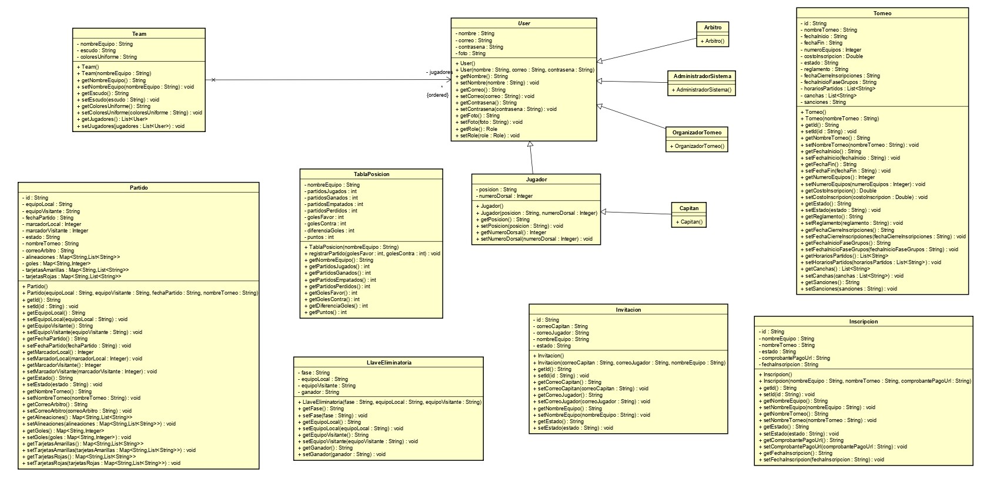
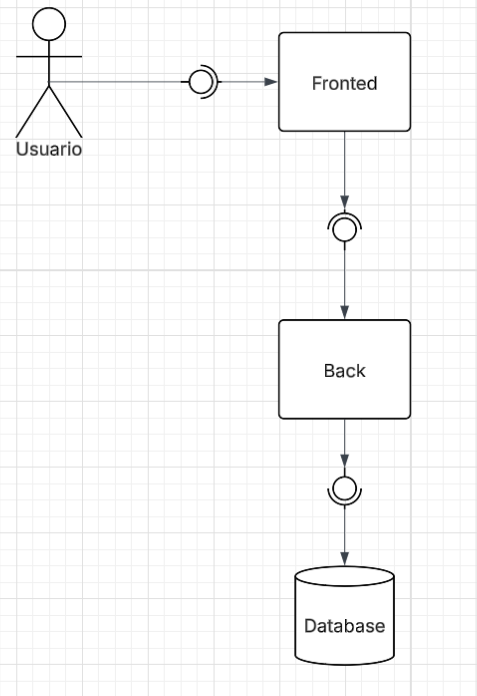

##  Backend (Sprint #1)
Este repositorio contiene la lógica de negocio y la infraestructura del lado del servidor para la plataforma TechCup. En este primer sprint, se ha establecido la arquitectura base, los modelos de dominio y la API funcional para la gestión de usuarios y equipos.

#  Arquitectura y Patrones de Diseño
El sistema ha sido desarrollado bajo el patrón de arquitectura MVC (Modelo-Vista-Controlador) utilizando el framework Spring Boot.

Patrones de Diseño Aplicados:
Inyección de Dependencias (DI): Implementada para desacoplar los controladores de la lógica de negocio en los servicios.
Singleton: Spring Boot gestiona los servicios y controladores como instancias únicas para optimizar el uso de memoria.
POJOs / Entities: Clases planas para la representación fiel de los requerimientos del negocio.

# Patrones de Diseño Utilizados

Esta sección explica los patrones de forma sencilla.

## 1) Factory Method

### ¿En qué parte del sistema se implementa en el código?
- En el flujo de registro y creación de usuarios.
- Se aplica justo cuando llega la información del usuario y se decide qué tipo de usuario construir según su rol.
- Es una implementación de backend enfocada en la capa de negocio de usuarios.

### ¿Por qué se eligió?
- Porque el dominio tiene variantes de usuario con reglas de construcción distintas.
- Porque centralizar la creación reduce el acoplamiento entre la capa de negocio y las clases concretas.
- Porque permite mantener el principio de responsabilidad única: crear objetos complejos en un punto especializado.

### ¿Cómo ayuda a resolver el problema del sistema?
- Evita inconsistencias al aplicar siempre las mismas reglas de creación para cada rol.
- Facilita extender el sistema sin tocar múltiples módulos cuando aparece un nuevo tipo de usuario.
- Mejora la mantenibilidad al concentrar validaciones iniciales y armado del objeto en una sola pieza.

## 2) Builder

### ¿En qué parte del sistema se implementa en el código?
- En la configuración de la documentación de la API.
- Se usa al construir paso a paso la información general del servicio (nombre, versión, descripción y datos de contacto).
- Es una implementación de backend orientada a la capa de configuración técnica.

### ¿Por qué se eligió?
- Porque la documentación de la API requiere ensamblar muchos atributos relacionados entre sí.
- Porque el armado por pasos hace explícita la intención de cada dato y mejora la legibilidad.
- Porque reduce el riesgo de constructores largos o inicializaciones confusas.

### ¿Cómo ayuda a resolver el problema del sistema?
- Disminuye errores de configuración al seguir una estructura de construcción ordenada.
- Permite evolucionar metadatos (versión, contacto, licencia) sin rehacer todo el bloque.
- Hace más simple revisar cambios en documentación técnica durante mantenimiento y auditoría.

## 3) Strategy

### ¿En qué parte del sistema se implementa en el código?
- En la lógica de generación de llaves eliminatorias del torneo.
- Se aplica cuando el sistema debe escoger una forma de emparejar equipos según las reglas del torneo.
- Es una implementación de backend en la capa de negocio de torneos y partidos.

### ¿Por qué se eligió?
- Porque el problema de emparejamiento no tiene una única regla válida para todos los torneos.
- Porque las políticas de cálculo cambian con el contexto (fase, formato o criterios organizativos).
- Porque separar algoritmos evita que una sola clase concentre decisiones de negocio cambiantes.

### ¿Cómo ayuda a resolver el problema del sistema?
- Permite intercambiar reglas de emparejamiento sin alterar el flujo principal del torneo.
- Mejora la extensibilidad: nuevas estrategias se agregan como alternativas, no como parches.
- Aumenta la testabilidad y la calidad, ya que cada algoritmo se prueba de forma aislada.

## 4) Singleton

### ¿En qué parte del sistema se implementa en el código?
- En los componentes compartidos del backend (servicios y configuraciones).
- Se aplica durante el ciclo de vida de la aplicación para reutilizar una sola instancia de cada componente común.
- Es una implementación transversal que impacta todas las capas del sistema.

### ¿Por qué se eligió?
- Porque varios servicios representan lógica compartida y no dependen del estado de un usuario específico.
- Porque una instancia única por componente reduce sobrecarga de creación y consumo innecesario de recursos.
- Porque favorece una gestión de dependencias estable y predecible en toda la aplicación.

### ¿Cómo ayuda a resolver el problema del sistema?
- Optimiza memoria y tiempo de inicialización al reutilizar instancias.
- Mantiene comportamiento consistente al evitar múltiples copias con configuraciones distintas.
- Simplifica la integración entre capas y hace más estable el ciclo de vida de los componentes.

## Cierre técnico

En resumen, estos patrones se eligieron porque reducen acoplamiento, mejoran cohesión, facilitan pruebas y permiten evolucionar reglas de negocio sin romper la arquitectura existente.

#  Requerimientos Funcionales Implementados (Demo Funcional)
RF1: Registro y Perfil de Jugador
Se implementó la entidad User que permite capturar la información técnica de los jugadores.

Atributos: Nombre, correo, contraseña (hash simulado), posición, número de dorsal y foto.
Validación de Negocio: El UserService garantiza que no existan registros con correos duplicados antes de añadirlos a la memoria.
RF2: Gestión de Equipos
Se implementó la entidad Team para la organización del torneo.

Atributos: Nombre del equipo, escudo, colores representativos y lista de jugadores asociados.
Relación: Un equipo puede contener múltiples objetos de tipo User (Jugadores).
#  Endpoints de la API (REST)
Para la Demo Funcional, el backend expone los siguientes puntos de acceso en http://localhost:8080:

### Diagrama De Clases

### Diagrama ded Componentes General

#  Diagramas de Secuencia

Para documentar el comportamiento del backend, se incluyen las 15 funcionalidades implementadas con una descripción funcional más detallada y un espacio para el diagrama de secuencia.

### 1. Inicio de sesión (Login)
Descripción: permite que un usuario ingrese al sistema usando correo y contraseña. El servicio verifica que las credenciales existan y coincidan con un usuario registrado; si son correctas, devuelve un token junto con su rol para controlar permisos en las demás operaciones.

Diagrama de secuencia:

### 2. Registro de usuario
Descripción: registra nuevos usuarios del sistema (por ejemplo, organizadores o administradores) validando campos obligatorios y reglas del dominio. Si la información es válida, el usuario se transforma a entidad, se almacena en memoria y se retorna su representación de respuesta.

Diagrama de secuencia:

### 3. Consulta de usuarios
Descripción: obtiene el listado completo de usuarios creados en la aplicación para tareas de administración y seguimiento. La consulta toma los datos almacenados, los transforma a DTO y los entrega en un formato seguro para el cliente.

Diagrama de secuencia:

### 4. Creación de equipo
Descripción: permite crear un equipo del torneo con su información principal (nombre, escudo y colores) y asociar jugadores existentes usando sus correos. Durante el proceso se valida la solicitud y se construye el equipo con su plantilla inicial.
Diagrama de secuencia:

### 5. Consulta de equipos
Descripción: retorna todos los equipos registrados para facilitar la visualización de participantes del torneo. La respuesta incluye los datos relevantes del equipo y su estado actual dentro de la información disponible en memoria.
Diagrama de secuencia:

### 6. Creación de torneo
Descripción: inicia un nuevo torneo con su configuración base y lo deja en estado BORRADOR para que pueda ser completado posteriormente. Esta funcionalidad centraliza la creación inicial de la competencia antes de abrir inscripciones o programar partidos.
Diagrama de secuencia:

### 7. Configuración de torneo
Descripción: actualiza la información operativa de un torneo existente, como reglamento, fechas, horarios, canchas y sanciones. Solo permite cambios cuando el torneo se encuentra en estados válidos, evitando modificaciones fuera del flujo definido por negocio.
Diagrama de secuencia:

### 8. Consulta de torneos
Descripción: consulta todos los torneos creados en el sistema para mostrar su información general y estado. Sirve como base para paneles de administración, seguimiento de competencia y selección de torneo en otros procesos.
Diagrama de secuencia:

### 9. Registro de inscripción
Descripción: registra la inscripción de un equipo al torneo incluyendo datos del pago o comprobante. El sistema valida la solicitud, crea el registro de inscripción y deja trazabilidad del proceso para su posterior revisión por el organizador.
Diagrama de secuencia:

### 10. Actualización de estado de inscripción
Descripción: permite que el organizador cambie el estado de una inscripción (por ejemplo, en revisión, aprobada o rechazada) de acuerdo con el flujo permitido. También valida que el nuevo estado sea correcto y que la inscripción exista antes de aplicar el cambio.
Diagrama de secuencia:

### 11. Consulta de inscripciones
Descripción: muestra todas las inscripciones registradas junto con su estado actual para facilitar control administrativo y toma de decisiones. Esta vista permite identificar rápidamente qué equipos están pendientes, aprobados o rechazados.
Diagrama de secuencia:

### 12. Registro de partido
Descripción: crea un partido entre dos equipos dentro del contexto de un torneo, guardando la información inicial necesaria para su gestión. Incluye validaciones de consistencia para asegurar que el encuentro quede correctamente preparado para etapas posteriores.
Diagrama de secuencia:

### 13. Actualización de marcador
Descripción: actualiza los goles o puntos de un partido y consolida el resultado final del encuentro. Además, valida que los marcadores sean válidos y cambia el estado del partido a FINALIZADO cuando corresponde.
Diagrama de secuencia:

### 14. Registro de alineación
Descripción: registra los jugadores que participarán en un partido para un equipo específico (local o visitante). La funcionalidad valida que el equipo pertenezca al encuentro y que la lista de jugadores cumpla condiciones mínimas antes de guardarla.
Diagrama de secuencia:

### 15. Registro de tarjetas
Descripción: permite registrar eventos disciplinarios de un partido, como tarjetas amarillas o rojas asociadas a un jugador. Este control aporta trazabilidad deportiva y soporta posteriores decisiones arbitrales o sancionatorias.
Diagrama de secuencia:

Archivo: pruebas.http
Uso: Ejecutar directamente desde IntelliJ IDEA para validar el flujo End-to-End (Controlador -> Servicio -> Memoria).

