# Manual de Identidad de Marca y UI - TECHCUP FÚTBOL

## 1. Introducción y Filosofía de Marca

La construcción de la marca **TECHCUP FÚTBOL** trasciende el ámbito estético; representa un ecosistema diseñado para dignificar y profesionalizar la gestión de torneos deportivos a nivel amateur y semi-profesional. 

Nuestro **elemento central** es la convergencia entre la pasión visceral por el deporte y la frialdad analítica de la tecnología de datos. Actuamos como el puente que transforma la organización caótica de un torneo de fin de semana en una experiencia de alto rendimiento y primer nivel tanto para organizadores como para jugadores.

### Valores Fundamentales:
- **Profesionalismo y Rigurosidad:** Dotamos de credibilidad a la gestión de datos deportivos, ofreciendo herramientas robustas y exactas.
- **Transparencia Inmediata:** Creemos en la democratización de la información. Resultados, estadísticas y sanciones siempre disponibles y en tiempo real.
- **Dinamismo Competitivo:** Reflejamos la energía del campo de juego en cada interacción de la plataforma, manteniendo vivo el espíritu competitivo sano.
- **Vanguardia Práctica:** La innovación tecnológica tiene sentido únicamente cuando resuelve problemas reales. Nuestra tecnología no es un adorno, es utilidad pura.

## 2. Nombre y Eslogan

- **Nombre de la Marca:** TECHCUP FÚTBOL
- **Eslogan Propuesto:** *"Tu torneo, tu estadio, tus reglas."* 

Logo: 
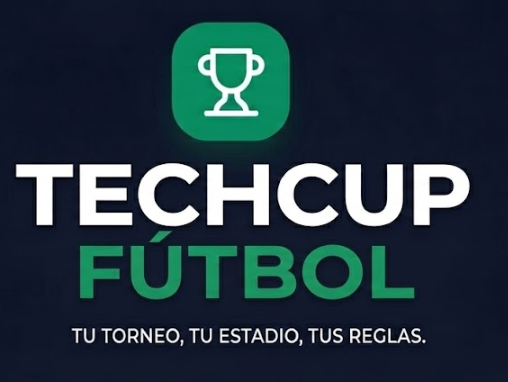

Isilogo (Logo sin texto): 

Isilogo Horizontal: 
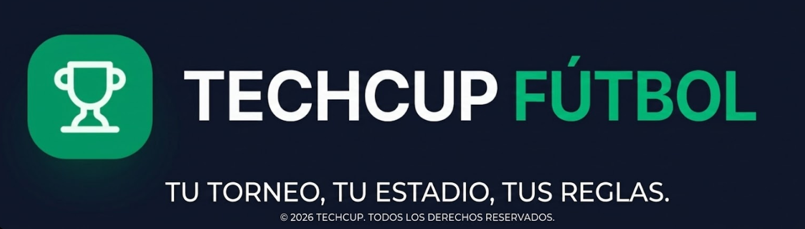

Isologo Monocromático: 
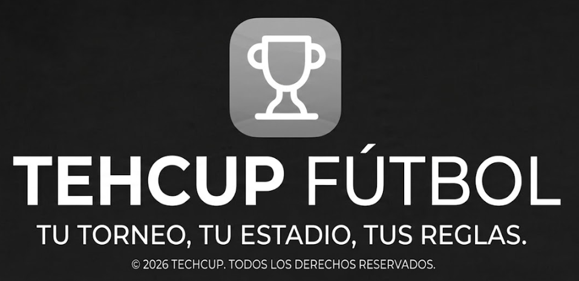

Isologo Simbolo en contorno: 
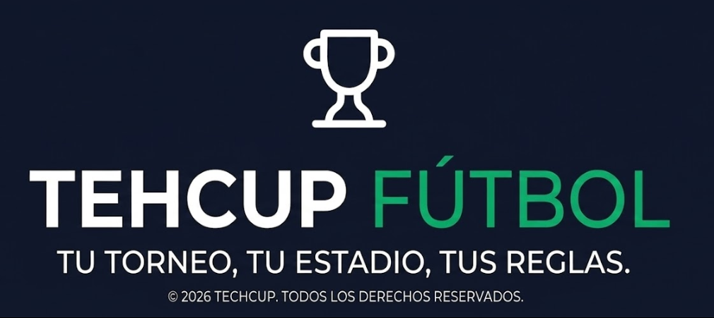

## 3. Público Objetivo

Nuestra plataforma está diseñada y optimizada para dos perfiles principales:

1. **Organizadores de Torneos (Administradores):**
   - **Perfil:** Personas o entidades dedicadas a gestionar ligas de fútbol 5, fútbol 7, y fútbol 11. Suelen lidiar con hojas de cálculo desactualizadas, problemas de cobros y desorganización de estadísticas.
   - **Necesidad Básica:** Eficiencia, gestión automatizada, control financiero, y un medio para proyectar profesionalismo hacia los equipos participantes.

2. **Jugadores, Capitanes y Aficionados (Usuarios Finales):**
   - **Perfil:** Deportistas amateur, entusiastas del fútbol que participan activamente en ligas competitivas. Les interesa revisar estadísticas personales (goleadores), consultar posiciones, horarios de partidos e incidencias disciplinarias (tarjetas).
   - **Necesidad Básica:** Experiencia fluida (preferentemente móvil), acceso inmediato a datos estadísticos de su rendimiento y el de sus rivales, todo desde un entorno visual atractivo que los haga sentir en una liga profesional.

## 4. Paleta de Colores

Nuestra arquitectura de color comunica solidez tecnológica (*Dark Mode*) y vitalidad deportiva (acento vibrante).

- **Verde Principal (Acento y Energía): `#00B37E`**
  - El núcleo visual de la marca. Evoca el césped del campo de juego fresco y las resoluciones afirmativas del ecosistema digital ("Éxito", "Adelante").
  - *Uso:* Logotipo principal, botones de acción primarios (CTA), resaltado de estadísticas clave y enlaces activos.

  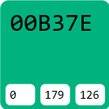

- **Verde Secundario (Apoyo Interactivo): `#0A2B27`**
  - Un tono profundo y sutil.
  - *Uso:* Fondos de selección, estados activos sutiles y transiciones de elementos enfocados (*hover states*).

 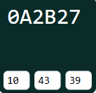  
  
- **Oscuros y Neutros (Estructura y Base): `#0B111A`, `#121926`, `#1C2434`**
  - Configuran la profundidad de la aplicación. Inspirados en una noche de estadio y paneles de análisis de datos.
  - *Uso:* Fondos globales (`#0B111A`), tarjetas/paneles (`#121926`) separadores estructurales y modales contextuales.

 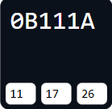 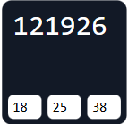 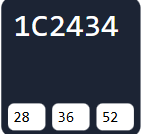

- **Colores de Semántica y Texto (Comunicación de Estados):`#FFFFFF`, `#94A3B8`, `#EF4444`**
  - Las alertas de disciplina (Tarjetas Rojas, exclusiones) emplean el **Rojo `#EF4444`**.
  - Los textos principales van en color **Blanco (`#FFFFFF`)**, mientras que las etiquetas descriptivas y metadatos se utilizan en **Gris Azulado (`#94A3B8`)** para definir jerarquías sin saturar la lectura.
 
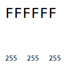 
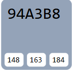
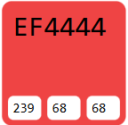

## 5. Tipografía

La voz visual de la marca es limpia, geométrica y sin adornos innecesarios, garantizando legibilidad perfecta en interfaces densas.

- **Familia Tipográfica:** **`Inter`** (o `Roboto` como segunda alternativa).
  - Es una tipografía de estilo *Neo-Grotesque* sin serifas, diseñada específicamente para pantallas y lectura de datos numéricos (ideal para tablas de posiciones y marcadores temporales).
- **Estructura de Pesos:**
  - **Encabezados (Títulos de página, Nombres de Equipos):** Pesos *Bold* (700) para un impacto visual directo y jerarquía clara.
  - **Puntuaciones y Estadísticas Numéricas:** Uso frecuente de *Semi-Bold* (600) para que las métricas relevantes llamen la atención inmediatamente.
  - **Descripciones Tabulares y Textos Comunes:** Grosores *Regular* (400) favoreciendo una lectura que evite la fatiga ocular y simplifique visualmente pantallas muy cargadas.

## 6. Imágenes Utilizadas

El uso fotográfico y gráfico en la plataforma se basa en el contraste, reforzando la narrativa de "tecnología + pasión".

- **Dirección de Arte y Fotografía:**
  - **Fuerza y Dinamismo:** Empleamos imágenes de estadios de noche iluminados, césped nítido o balones en movimiento con enfoques dramáticos o de baja exposición de fondo. Tratamiento y filtros que integran los tonos oscuros de la paleta.
  - **Carga Emotiva del Jugador:** Imágenes de celebración, concentración, cordones atándose. Trazamos un paralelo con el jugador profesional.
- **Avatares y Escudos:**
  - Las imágenes cargadas por los usuarios (escudos de equipo, perfiles) van enmarcadas en geométricos estilizados (polígonos, círculos con bordes de `#1C2434`), con tratamientos que resalten los logos de los equipos y minimicen fondos ruidosos.
- **Ausencia de Imágenes Genéricas:** Evitamos a toda costa "fotos de stock corporativas" sonrientes. El tono es sudor, cancha, luces de estadio tácticas y pizarras de estrategia.

## 7. Elementos Visuales del Diseño (Guía de Estilo UI)

### 7.1. Botones (Call to Action)
- **Botón Primario ("El Disparo"):** Fondos enteramente de Verde Principal (`#00B37E`), texto en blanco, bordes con un suavizado moderno (*border-radius* no circular, sino redondeado técnico de aprox `6px - 8px`). Utilizado solo para las acciones más críticas de la pantalla (ej. "Iniciar Sesión", "Crear Torneo").
- **Botón Secundario ("El Pase"):** Con fondo transparente y borde delineado en plateado o verde claro. Utilizados como acciones suplementarias (Cancelar, Editar Perfil).

### 7.2. Iconografía
- **Estética Vectorial Lineal:** Iconos limpios, minimalistas, de trazo continuo o "wireframe", del mismo grosor que la tipografía principal para conservar un aspecto quirúrgico y equilibrado (`stroke-width` uniforme).
- **Semiótica Deportiva Contemporánea:** Íconos tácticos para estrategia, silbatos estilizados para arbitraje y trofeos que huyan de un estilo *cartoony*. Deben lucir tan sofisticados como la interfaz de un videojuego deportivo moderno (Ej. FIFA/EAFC o Football Manager).

### 7.3. Indicadores (Badges / Pills)
- **Alertas Constantes:** Formas ovaladas compactas con un indicador luminoso (punto de estatus). Utilizados de manera crítica para mostrar "EN CURSO", estados de pago o conexiones activas de la liga.
- **Alertas Disciplinarias:** Las tarjetas amarillas y rojas se representan literalmente como pequeños rectángulos coloreados, limpios y de borde recto integrados junto a los nombres de los jugadores.

### 7.4. Formularios y Entradas (Inputs)
- Las cajas de introducción de texto contrastan sensiblemente su fondo (`#0B111A`) sobre la superficie de las tarjetas (`#121926`). Se enfocan (*Focus State*) rodeando el input con un destello en Verde Principal (`#00B37E`), retroalimentando positivamente la interacción del usuario sin margen de error.
