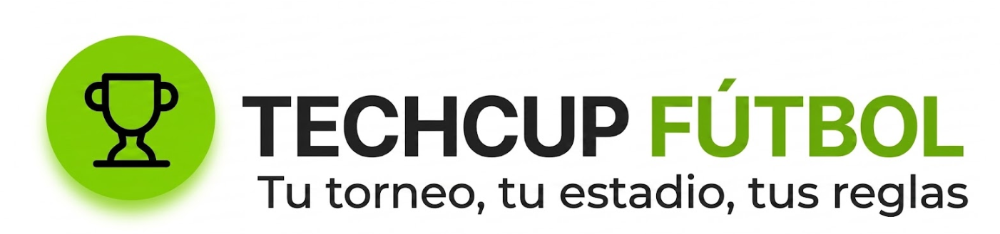
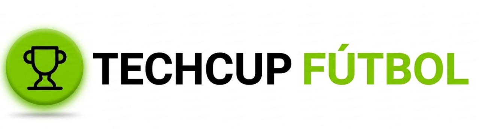
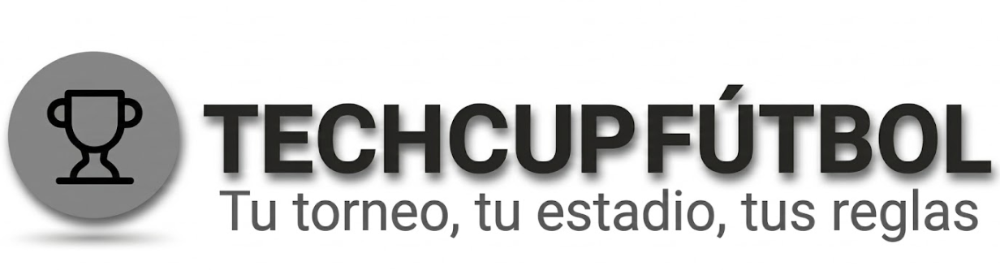
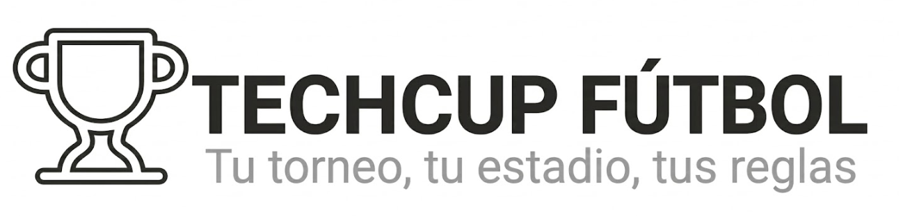
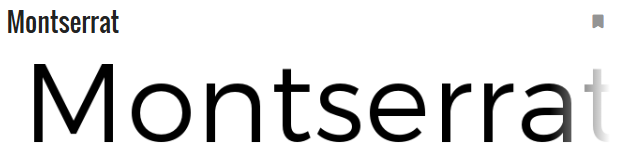
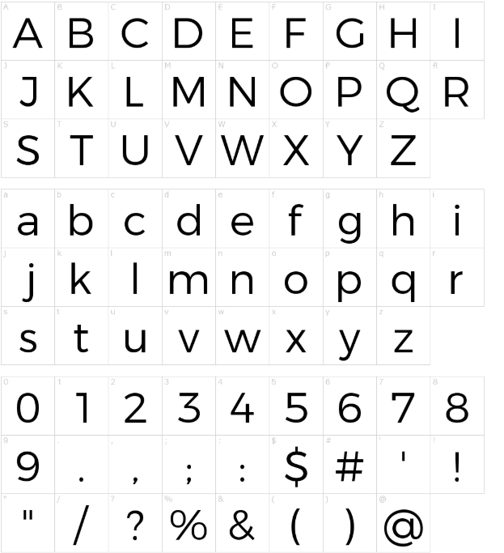
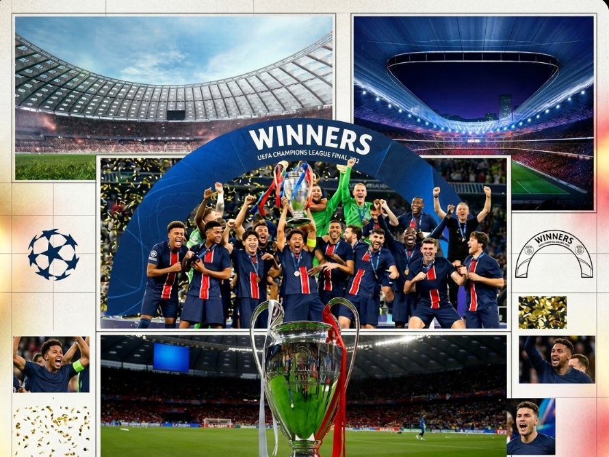
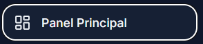
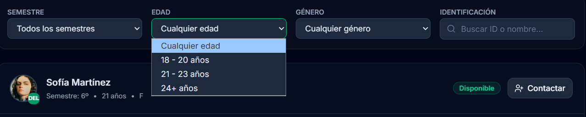
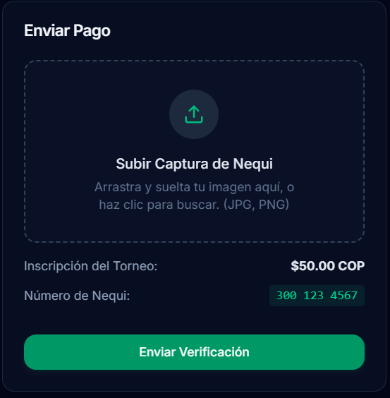

# Manual de Identidad de Marca y UI - TECHCUP FÚTBOL

## 1. Introducción y Filosofía de Marca

La construcción de la marca **TECHCUP FÚTBOL** trasciende el ámbito estético; representa un ecosistema diseñado para dignificar y profesionalizar la gestión de torneos deportivos a nivel amateur y semi-profesional. 

Nuestro **elemento central** es la convergencia entre la pasión visceral por el deporte y la frialdad analítica de la tecnología de datos. Actuamos como el puente que transforma la organización caótica de un torneo de fin de semana en una experiencia de alto rendimiento y primer nivel tanto para organizadores como para jugadores.

### Valores Fundamentales:
- **Profesionalismo y Rigurosidad:** Dotamos de credibilidad a la gestión de datos deportivos, ofreciendo herramientas robustas y exactas.
- **Transparencia Inmediata:** Creemos en la democratización de la información. Resultados, estadísticas y sanciones siempre disponibles y en tiempo real.
- **Dinamismo Competitivo:** Reflejamos la energía del campo de juego en cada interacción de la plataforma, manteniendo vivo el espíritu competitivo sano.
- **Vanguardia Práctica:** La innovación tecnológica tiene sentido únicamente cuando resuelve problemas reales. Nuestra tecnología no es un adorno, es utilidad pura.

## 2. Nombre y Eslogan

- **Nombre de la Marca:** TECHCUP FÚTBOL
- **Eslogan Propuesto:** *"Tu torneo, tu estadio, tus reglas."* 

**Logo Principal (Imagotipo):** 
Uso primario en la aplicación, encabezados, documentos oficiales y material promocional de alto impacto. Debe ser la primera opción siempre que el espacio lo permita.

**Isologo (Símbolo sin texto):** 
Uso destinado para avatares, favicons, iconos de aplicación móvil (App Icon) o en espacios cuadrados reducidos donde la lectura del texto de la marca sea imposible.

**Isologo Horizontal:** 
Uso óptimo para barras de navegación superiores (*Topbars* o *Sidebars* colapsados) y banners donde el espacio vertical sea extremadamente limitado.

**Isologo Monocromático:** 
Uso restringido para fondos fotográficos complejos, marcas de agua corporativas, material impreso a una tinta o en estados neutros/inactivos de la UI.

**Símbolo en Contorno (Wireframe/Outline):** 
Uso en detalles estéticos de fondo (marcas de agua gigantes opacas deportivas), cargadores (*loaders*), o en aplicaciones de bordado y serigrafía simple.

## 3. Público Objetivo

Nuestra plataforma está diseñada y optimizada para dos perfiles principales:

1. **Organizadores de Torneos (Administradores):**
   - **Perfil:** Personas o entidades dedicadas a gestionar ligas de fútbol 5, fútbol 7, y fútbol 11. Suelen lidiar con hojas de cálculo desactualizadas, problemas de cobros y desorganización de estadísticas.
   - **Necesidad Básica:** Eficiencia, gestión automatizada, control financiero, y un medio para proyectar profesionalismo hacia los equipos participantes.

2. **Jugadores, Capitanes y Aficionados (Usuarios Finales):**
   - **Perfil:** Deportistas amateur, entusiastas del fútbol que participan activamente en ligas competitivas. Les interesa revisar estadísticas personales (goleadores), consultar posiciones, horarios de partidos e incidencias disciplinarias (tarjetas).
   - **Necesidad Básica:** Experiencia fluida (preferentemente móvil), acceso inmediato a datos estadísticos de su rendimiento y el de sus rivales, todo desde un entorno visual atractivo que los haga sentir en una liga profesional.

## 4. Paleta de Colores

Nuestra arquitectura de color ha evolucionado para comunicar accesibilidad y legibilidad a través de un espacio luminoso (*Light Mode*), contrastado con una vitalidad deportiva mediante un verde lima/manzana de muy alta energía.

- **Verde Principal (Acento y Energía): `#84CC16` (Verde Lima Vibrante)**
  - El núcleo visual de la marca y foco de atención. Evoca el césped de día, modernidad y actividad constante.
  - *Uso:* Logotipo principal, botones de acción primarios (CTA: "Iniciar Sesión"), resaltes de estadísticas fundamentales (ej. Puntos en la tabla), estados afirmativos ("EN CURSO").

  

- **Verde Secundario (Apoyo Interactivo y Pastel): `#ECFCCB` (Verde Claro Suave)**
  - Tono pastel derivado del principal para acompañamiento sutil, generando volumen sin quitar protagonismo a los textos.
  - *Uso:* Fondos de botones de navegación destacados (Ej. "Panel Principal"), etiquetas de temporada o contenedores promocionales (Ej. "Sorteo de Cuartos").

   
  
- **Superficies y Fondos Objeto (Estructura y Base): `#FFFFFF`, `#F8FAFC`, `#E5E7EB`**
  - Generan el contraste negativo necesario para la legibilidad perfecta de un dashboard denso en datos.
  - *Uso:* El fondo principal de la aplicación es un gris muy claro (`#F8FAFC`), mientras que las tarjetas o contenedores se elevan visualmente usando blanco puro (`#FFFFFF`). Los bordes y líneas divisorias de las tablas son grises tenues (`#E5E7EB`).

   

- **Colores de Semántica y Texto (Lectura Crítica): `#111827`, `#6B7280`, `#EF4444`**
  - Los textos principales (títulos y posiciones) se leen en un gris oscuro muy cercano al negro (`#111827` o `#1F2937`), sustituyendo al negro puro por confort visual.
  - Los metadatos (fechas, subtítulos inactivos y cabeceras de tabla) emplean un gris medio (`#6B7280`).
  - El color rojo semántico (`#EF4444`) se mantiene reservado estrictamente para advertencias o sanciones (Tarjetas Rojas).
 
 

## 5. Tipografía

La voz visual de la marca es limpia, geométrica y sin adornos innecesarios, garantizando legibilidad perfecta en interfaces densas.

- **Familia Tipográfica:** **`Inter`** (o `Roboto` como segunda alternativa).
  - Es una tipografía de estilo *Neo-Grotesque* sin serifas, diseñada específicamente para pantallas y lectura de datos numéricos (ideal para tablas de posiciones y marcadores temporales).
- **Estructura de Pesos:**
  - **Encabezados (Títulos de página, Nombres de Equipos):** Pesos *Bold* (700) para un impacto visual directo y jerarquía clara.
  - **Puntuaciones y Estadísticas Numéricas:** Uso frecuente de *Semi-Bold* (600) para que las métricas relevantes llamen la atención inmediatamente.
  - **Descripciones Tabulares y Textos Comunes:** Grosores *Regular* (400) favoreciendo una lectura que evite la fatiga ocular y simplifique visualmente pantallas muy cargadas.

*Muestra del espécimen tipográfico principal:*

*Abecedario y variaciones de grosores de la fuente:*

## 6. Imágenes Utilizadas

El uso fotográfico y gráfico en la plataforma se basa en el contraste, reforzando la narrativa de "tecnología + pasión".

- **Dirección de Arte y Fotografía:**
  - **Fuerza y Dinamismo:** Empleamos imágenes de estadios de noche iluminados, césped nítido o balones en movimiento con enfoques dramáticos o de baja exposición de fondo. Tratamiento y filtros que integran los tonos oscuros de la paleta.
  - **Carga Emotiva del Jugador:** Imágenes de celebración, concentración, cordones atándose. Trazamos un paralelo con el jugador profesional.
- **Avatares y Escudos:**
  - Las imágenes cargadas por los usuarios (escudos de equipo, perfiles) van enmarcadas en geométricos estilizados (polígonos, círculos con bordes de `#1C2434`), con tratamientos que resalten los logos de los equipos y minimicen fondos ruidosos.
- **Ausencia de Imágenes Genéricas:** Evitamos a toda costa "fotos de stock corporativas" sonrientes. El tono es sudor, cancha, luces de estadio tácticas y pizarras de estrategia.

*Moodboard referencial:*

## 7. Elementos Visuales del Diseño (Guía de Estilo UI)

### 7.1. Botones (Call to Action)
- **Botón Primario ("El Disparo"):** Fondos enteramente de Verde Principal (`#00B37E`), texto en blanco, bordes con un suavizado moderno (*border-radius* no circular, sino redondeado técnico de aprox `6px - 8px`). Utilizado solo para las acciones más críticas de la pantalla (ej. "Iniciar Sesión", "Crear Torneo").
- **Botón Secundario ("El Pase"):** Con fondo transparente y borde delineado en plateado o verde claro. Utilizados como acciones suplementarias (Cancelar, Editar Perfil).

### 7.2. Iconografía
- **Estética Vectorial Lineal:** Iconos limpios, minimalistas, de trazo continuo o "wireframe", del mismo grosor que la tipografía principal para conservar un aspecto quirúrgico y equilibrado (`stroke-width` uniforme).
- **Semiótica Deportiva Contemporánea:** Íconos tácticos para estrategia, silbatos estilizados para arbitraje y trofeos que huyan de un estilo *cartoony*. Deben lucir tan sofisticados como la interfaz de un videojuego deportivo moderno (Ej. FIFA/EAFC o Football Manager).

### 7.3. Indicadores (Badges / Pills)
- **Alertas Constantes:** Formas ovaladas compactas con un indicador luminoso (punto de estatus). Utilizados de manera crítica para mostrar "EN CURSO", estados de pago o conexiones activas de la liga.
- **Alertas Disciplinarias:** Las tarjetas amarillas y rojas se representan literalmente como pequeños rectángulos coloreados, limpios y de borde recto integrados junto a los nombres de los jugadores.

### 7.4. Formularios y Entradas (Inputs)
- Las cajas de introducción de texto contrastan sensiblemente su fondo (`#0B111A`) sobre la superficie de las tarjetas (`#121926`). Se enfocan (*Focus State*) rodeando el input con un destello en Verde Principal (`#00B37E`), retroalimentando positivamente la interacción del usuario sin margen de error.

*Referencias visuales de los componentes UI interactivos (Botones, Iconografía e Inputs):*

