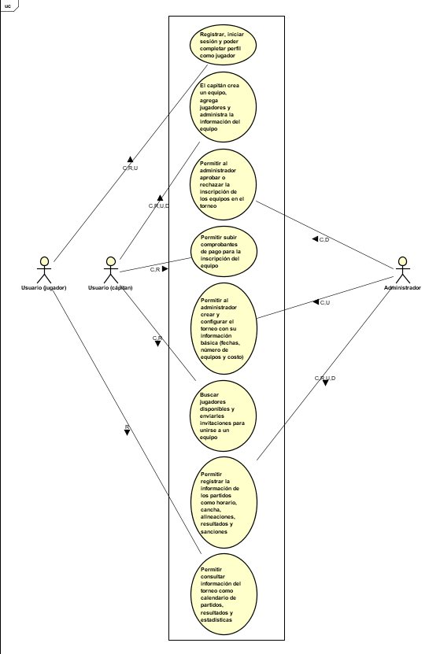

# Requerimientos funcionales principales

1. Gestionar torneos: crear, iniciar, finalizar y consultar torneos.
2. Registrar usuarios y jugadores por rol (estudiante, graduado, profesor, administrativo, familiar, capitán, organizador, árbitro, administrador).
3. Gestionar equipos: crear equipo, invitar jugadores y validar reglas de conformación (mínimo/máximo de jugadores y sin duplicidad).
4. Gestionar inscripciones y pagos: cargar comprobante y administrar estados (pendiente, en revisión, aprobado, rechazado).
5. Configurar torneo: reglamento, fechas clave, cierre de inscripciones, horarios, canchas y sanciones.
6. Registrar partidos: marcador, goleadores y tarjetas.
7. Calcular automáticamente tabla de posiciones y generar llaves eliminatorias.
8. Consultar información del torneo: calendario, resultados, estadísticas e información para árbitros.

# Requerimientos no funcionales principales

1. Diseño responsivo: la plataforma debe adaptarse correctamente a pantallas de celular y computador.
2. Seguridad y acceso: autenticación según tipo de usuario (correo institucional o Gmail) y control de roles/permisos.
3. Auditoría: registrar acciones relevantes para trazabilidad de cambios y operaciones.
4. Rendimiento: tiempos de respuesta adecuados en operaciones frecuentes (consulta de tabla, partidos, equipos e inscripciones).
5. Disponibilidad y confiabilidad: el sistema debe estar estable durante periodos críticos del torneo.
6. Arquitectura mantenible: backend por capas con API REST, frontend en React + TypeScript y base de datos PostgreSQL.
7. Integridad de datos: validaciones automáticas de reglas del torneo para evitar inconsistencias.

# Requerimientos funcionales detallados

RF-001: Gestionar Torneos

## Funcionalidad

| Código | Nombre |
|--------|--------|
| RF-001 | Gestión de Torneos |

| Descripción | Cómo se ejecuta | Actor principal | Precondiciones |
|-------------|-----------------|-----------------|-----------------|
| El sistema permite crear, configurar, iniciar y finalizar torneos. Un organizador puede definir la información básica del torneo (fechas, cantidad de equipos, costo) y cambiar su estado entre Borrador, Activo, En progreso y Finalizado. | El organizador accede a la sección de torneos y crea uno nuevo con los datos básicos. Luego puede iniciar el torneo cuando sea el momento. | Organizador | El usuario debe tener rol de organizador. |

## Datos de entrada

| Nombre | Descripción | Tipo de campo | Reglas/Aplicación | Obligatorio |
|--------|-------------|----------------|-------------------|-------------|
| Nombre del torneo | Identificador del torneo | Texto | Sin caracteres especiales | Sí |
| Fecha inicial | Fecha de inicio del torneo | Fecha | Formato YYYY-MM-DD | Sí |
| Fecha final | Fecha de finalización del torneo | Fecha | Debe ser posterior a la fecha inicial | Sí |
| Cantidad de equipos | Número de equipos que participarán | Número | Mínimo 4, máximo 32 | Sí |
| Costo por equipo | Valor a pagar por cada equipo | Dinero | Valor en pesos colombianos | Sí |

## Datos de salida

| Nombre | Descripción | Tipo de campo | Reglas/Aplicación | Obligatorio |
|--------|-------------|----------------|-------------------|-------------|
| ID del torneo | Identificador único asignado | Número | Generado automáticamente | Sí |
| Estado del torneo | Estado actual del torneo | Selección | Borrador, Activo, En progreso, Finalizado | Sí |
| Mensaje de confirmación | Confirmación de la acción realizada | Texto | Mensaje de éxito o error | Sí |

## Flujo básico

| Paso | Actor | Descripción | Excepciones |
|------|-------|-------------|-------------|
| 1 | Organizador | Accede a la sección "Gestión de torneos" | Organizador no autenticado: redirigir a login |
| 2 | Organizador | Selecciona "Crear nuevo torneo" | - |
| 3 | Organizador | Ingresa información básica (nombre, fechas, cantidad de equipos, costo) | Fechas inválidas: mostrar error |
| 4 | Organizador | Confirma la creación del torneo | - |
| 5 | Sistema | Valida datos y crea el torneo con estado "Borrador" | Datos incompletos: mostrar error |
| 6 | Sistema | Genera ID único y confirma creación | - |

## Flujo alterno

| Paso | Actor | Descripción | Excepciones |
|------|-------|-------------|-------------|
| 1 | Organizador | Selecciona un torneo existente | Torneo no encontrado: mostrar error |
| 2 | Organizador | Selecciona "Iniciar torneo" | Torneo no está en estado Borrador: mostrar error |
| 3 | Sistema | Cambia el estado a "Activo" y activa el período de inscripciones | - |
| 4 | Organizador | Selecciona "Finalizar torneo" (después de "En progreso") | Torneo no está en estado "En progreso": mostrar error |
| 5 | Sistema | Cambia estado a "Finalizado" y cierra inscripciones | - |

RF-002: Registrar Usuarios y Jugadores

## Funcionalidad

| Código | Nombre |
|--------|--------|
| RF-002 | Registro de Usuarios y Jugadores |

| Descripción | Cómo se ejecuta | Actor principal | Precondiciones |
|-------------|-----------------|-----------------|-----------------|
| Cada participante (estudiante, graduado, profesor, administrativo, familiar) se registra en el sistema con su correo (institucional o Gmail según corresponda), crea su perfil deportivo indicando posiciones, dorsal y sube foto. Puede marcarse como disponible para que capitanes lo contacten. | El usuario accede a la plataforma, elige su tipo de rol, se autentica con correo, completa su perfil deportivo y confirma disponibilidad. | Jugador/Estudiante/Graduado/Profesor/Administrativo/Familiar | Ninguna (primer acceso) |

## Datos de entrada

| Nombre | Descripción | Tipo de campo | Reglas/Aplicación | Obligatorio |
|--------|-------------|----------------|-------------------|-------------|
| Correo | Correo para autenticarse | Correo electrónico | Correo institucional o Gmail según rol | Sí |
| Nombre completo | Nombre del usuario | Texto | Sin caracteres especiales | Sí |
| Identificación | Número de cédula o pasaporte | Texto | Formato válido sin guiones | Sí |
| Posiciones | Posiciones de juego (portero, defensa, volante, delantero) | Selección múltiple | Al menos una posición | Sí |
| Dorsal | Número de camiseta preferido | Número | Entre 1 y 99 | Sí |
| Foto | Imagen de perfil | Archivo | Formato JPEG/PNG, máximo 5 MB | Sí |
| Disponibilidad | Disponible para que capitanes lo contacten | Booleano | Sí/No | Sí |
| Semestre (si estudiante) | Semestre académico | Número | Entre 1 y 12 | No |
| Género | Género del jugador | Selección | Masculino, Femenino, Otro | Sí |
| Edad | Edad del jugador | Número | Mayor o igual a 16 | Sí |

## Datos de salida

| Nombre | Descripción | Tipo de campo | Reglas/Aplicación | Obligatorio |
|--------|-------------|----------------|-------------------|-------------|
| ID de usuario | Identificador único | Número | Generado automáticamente | Sí |
| Perfil completado | Confirmación de registro | Booleano | Sí/No | Sí |
| Mensaje de confirmación | Confirmación de créación | Texto | Mensaje de éxito | Sí |

## Flujo básico

| Paso | Actor | Descripción | Excepciones |
|------|-------|-------------|-------------|
| 1 | Jugador | Accede a la plataforma | - |
| 2 | Jugador | Selecciona su tipo de rol (estudiante, graduado, profesor, etc.) | - |
| 3 | Jugador | Se autentica con correo institucional o Gmail | Correo no existe: crear cuenta nueva o mostrar error |
| 4 | Jugador | Completa su perfil (nombre, ID, posiciones, dorsal, sube foto) | Datos faltantes: mostrar campos obligatorios |
| 5 | Jugador | Indica disponibilidad para que capitanes lo contacten | - |
| 6 | Sistema | Valida datos y crea el perfil deportivo | - |
| 7 | Sistema | Confirma registro exitoso | - |

## Flujo alterno

| Paso | Actor | Descripción | Excepciones |
|------|-------|-------------|-------------|
| 1 | Jugador | Ya tiene cuenta creada y accede a "Editar perfil" | Usuario no autenticado: redirigir a login |
| 2 | Jugador | Actualiza información (posiciones, dorsal, foto, disponibilidad) | - |
| 3 | Sistema | Valida cambios y actualiza perfil | - |
| 4 | Jugador | Puede recibir invitaciones de capitanes | Invitación rechazada: se elimina de la lista de contactos del capitán |

RF-003: Gestionar Equipos (Creación, invitaciones, búsqueda de jugadores)

## Funcionalidad

| Código | Nombre |
|--------|--------|
| RF-003 | Gestión de Equipos |

| Descripción | Cómo se ejecuta | Actor principal | Precondiciones |
|-------------|-----------------|-----------------|-----------------|
| Los capitanes crean equipos con nombre, escudo, colores de uniforme. Invitan jugadores a sus equipos respetando las reglas: mínimo 7 jugadores, máximo 12, sin duplicidad de jugador en equipos, más de la mitad de los miembros deben ser de los programas de Ingeniería de Sistemas, IA, Ciberseguridad y Estadística. Los capitanes pueden buscar jugadores disponibles por posición, semestre, edad, género, nombre e identificación. | El capitán accede a su panel, crea el equipo ingresando nombre, carga escudo e indica colores. Luego busca jugadores por criterios y envía invitaciones. Los jugadores aceptan o rechazan iniciativas. | Capitán | El usuario debe tener o cambiar a rol de capitán. Debe existir un torneo activo. |

## Datos de entrada (Crear equipo)

| Nombre | Descripción | Tipo de campo | Reglas/Aplicación | Obligatorio |
|--------|-------------|----------------|-------------------|-------------|
| Nombre del equipo | Nombre del equipo | Texto | Sin caracteres especiales | Sí |
| Escudo | Logo o imagen del equipo | Archivo | Formato JPEG/PNG, máximo 5 MB | Sí |
| Color uniforme (primario) | Color principal del uniforme | Color | Código hexadecimal | Sí |
| Color uniforme (secundario) | Color secundario del uniforme | Color | Código hexadecimal | No |

## Datos de entrada (Búsqueda de jugadores)

| Nombre | Descripción | Tipo de campo | Reglas/Aplicación | Obligatorio |
|--------|-------------|----------------|-------------------|-------------|
| Posición | Filtro por posición de juego | Selección | Portero, Defensa, Volante, Delantero | No |
| Semestre | Filtro por semestre académico | Número | Aplica solo a estudiantes | No |
| Edad | Filtro por edad | Número | Rango mínimo y máximo | No |
| Género | Filtro por género | Selección | Masculino, Femenino, Otro | No |
| Nombre | Búsqueda por nombre | Texto | Búsqueda parcial permitida | No |
| Identificación | Búsqueda por ID | Texto | Búsqueda exacta | No |

## Datos de salida

| Nombre | Descripción | Tipo de campo | Reglas/Aplicación | Obligatorio |
|--------|-------------|----------------|-------------------|-------------|
| ID del equipo | Identificador único | Número | Generado automáticamente | Sí |
| Lista de jugadores disponibles | Resultados de búsqueda | Lista | Jugadores marcados como disponibles | Sí |
| Estado de invitación | Estado de la invitación enviada | Selección | Pendiente, Aceptada, Rechazada | Sí |
| Mensaje de confirmación | Confirmación de acción | Texto | Mensaje de éxito o error | Sí |

## Flujo básico

| Paso | Actor | Descripción | Excepciones |
|------|-------|-------------|-------------|
| 1 | Capitán | Accede a su panel de equipo | Capitán no autenticado: redirigir a login |
| 2 | Capitán | Selecciona "Crear nuevo equipo" | Torneo no activo: mostrar error |
| 3 | Capitán | Ingresa nombre del equipo, carga escudo e indica colores | Datos incompletos: mostrar campos obligatorios |
| 4 | Sistema | Valida nombre único del equipo en el torneo | Nombre duplicado: mostrar error |
| 5 | Sistema | Crea el equipo y asigna ID único | - |
| 6 | Capitán | Accede a "Buscar jugadores" | - |
| 7 | Capitán | Aplica filtros (posición, semestre, edad, género, nombre, ID) | Sin resultados: mostrar mensaje |
| 8 | Sistema | Muestra lista de jugadores disponibles | - |
| 9 | Capitán | Selecciona jugadores e invita a su equipo | - |
| 10 | Sistema | Envía invitación al jugador | - |
| 11 | Jugador | Recibe invitación y acepta o rechaza | Rechaza: no se suma al equipo |
| 12 | Sistema | Actualiza lista de miembros del equipo | - |

## Flujo alterno

| Paso | Actor | Descripción | Excepciones |
|------|-------|-------------|-------------|
| 1 | Capitán | Intenta invitar a jugador que ya pertenece a otro equipo | Sistema previene duplicidad: mostrar error |
| 2 | Sistema | Valida reglas de conformación (mínimo 7, máximo 12) | Límite alcanzado: no permitir más invitaciones |
| 3 | Sistema | Valida que más del 50% sean de programas autorizados | Validación fallida: mostrar advertencia |
| 4 | Jugador | Recibe múltiples invitaciones de equipos | Puede aceptar una sola: rechazar las demás automáticamente |

RF-004: Gestionar Inscripciones y Pagos

## Funcionalidad

| Código | Nombre |
|--------|--------|
| RF-004 | Gestión de Inscripciones y Pagos |

| Descripción | Cómo se ejecuta | Actor principal | Precondiciones |
|-------------|-----------------|-----------------|-----------------|
| El capitán realiza el pago por NEQUI o efectivo al coordinador del evento y luego sube el comprobante a la plataforma. El organizador revisa el documento y cambia el estado de la inscripción de Pendiente a En revisión, Aprobado (inscrito) o Rechazado. Solo equipos aprobados pueden participar en el torneo. | El capitán sube el comprobante de pago en la sección de inscripciones. El organizador revisa la imagen y aprueba o rechaza según validación de pago. | Capitán (sube comprobante), Organizador (revisa y aprueba) | Torneo debe estar activo. Equipo debe estar completamente conformado. |

## Datos de entrada (Capitán)

| Nombre | Descripción | Tipo de campo | Reglas/Aplicación | Obligatorio |
|--------|-------------|----------------|-------------------|-------------|
| Comprobante de pago | Imagen o documento de transferencia | Archivo | Formato JPEG/PNG/PDF, máximo 5 MB | Sí |
| Referencia de pago | Número de referencia de transferencia | Texto | Proporcionado por banco/NEQUI | Sí |
| Monto pagado | Valor pagado | Dinero | Debe coincidir con costo del torneo | Sí |

## Datos de entrada (Organizador)

| Nombre | Descripción | Tipo de campo | Reglas/Aplicación | Obligatorio |
|--------|-------------|----------------|-------------------|-------------|
| Decisión de revisión | Aprobar o rechazar inscripción | Selección | Aprobado, Rechazado | Sí |
| Motivo de rechazo (si aplica) | Explicación por la que se rechaza | Texto | Libre | No |

## Datos de salida

| Nombre | Descripción | Tipo de campo | Reglas/Aplicación | Obligatorio |
|--------|-------------|----------------|-------------------|-------------|
| Estado de inscripción | Estado actual del equipo | Selección | Pendiente, En revisión, Aprobado, Rechazado | Sí |
| Mensaje de confirmación | Confirmación de acción | Texto | Mensaje de éxito o error | Sí |
| Notificación al capitán | Notificación de aceptación/rechazo | Correo electrónico | Enviado automáticamente | Sí |

## Flujo básico

| Paso | Actor | Descripción | Excepciones |
|------|-------|-------------|-------------|
| 1 | Capitán | Accede a "Inscripciones" en su panel de equipo | Capitán no autenticado: redirigir a login |
| 2 | Capitán | Realiza pago del equipo (NEQUI o efectivo) | - |
| 3 | Capitán | Accede a "Subir comprobante" | Torneo cerrado: mostrar error |
| 4 | Capitán | Carga imagen del comprobante y referencia de pago | Archivo no válido: mostrar error |
| 5 | Sistema | Valida formato y tamaño del archivo | - |
| 6 | Sistema | Cambia estado de inscripción a "En revisión" | - |
| 7 | Organizador | Accede a panel de revisión de inscripciones | Organizador no autenticado: redirigir a login |
| 8 | Organizador | Visualiza comprobante y verifica pago | - |
| 9 | Organizador | Aprueba o rechaza inscripción | - |
| 10 | Sistema | Cambia estado a "Aprobado" o "Rechazado" | - |
| 11 | Sistema | Envía notificación al correo del capitán | - |

## Flujo alterno

| Paso | Actor | Descripción | Excepciones |
|------|-------|-------------|-------------|
| 1 | Organizador | Rechaza inscripción con motivo | Capitán recibe notificación con razón del rechazo |
| 2 | Capitán | Puede resubir comprobante correcto | Máximo 3 intentos permitidos |
| 3 | Sistema | Valida nuevo comprobante | - |

RF-005: Configurar Torneo (Reglamento, fechas, horarios, canchas, sanciones)

## Funcionalidad

| Código | Nombre |
|--------|--------|
| RF-005 | Configuración del Torneo |

| Descripción | Cómo se ejecuta | Actor principal | Precondiciones |
|-------------|-----------------|-----------------|-----------------|
| Después de crear el torneo, el organizador define el reglamento, fechas importantes (cierre de inscripciones, inicio de fase de grupos), horarios de partidos, canchas disponibles y sanciones. Esta información se publica en la plataforma para que todos los participantes la vean. | El organizador accede a la sección "Configuración" del torneo y completa cada campo. Los cambios se guardan y se publican inmediatamente en la sección de información del torneo. | Organizador | Torneo debe existir y estar en estado "Borrador" o "Activo". |

## Datos de entrada

| Nombre | Descripción | Tipo de campo | Reglas/Aplicación | Obligatorio |
|--------|-------------|----------------|-------------------|-------------|
| Reglamento | Reglas del torneo | Texto largo | Máximo 10000 caracteres | Sí |
| Fecha cierre inscripciones | Fecha límite para inscribirse | Fecha | Formato YYYY-MM-DD, anterior a fecha de inicio | Sí |
| Fecha inicio fase de grupos | Fecha de inicio de partidos | Fecha | Posterior a fecha inicial del torneo | Sí |
| Horarios de partidos | Horas disponibles para partidos | Lista de horas | Formato HH:MM | Sí |
| Canchas | Listado de canchas disponibles | Texto | Nombre y ubicación de cada cancha | Sí |
| Sanciones | Definición de tarjetas y expulsiones | Texto largo | Máximo 5000 caracteres | Sí |

## Datos de salida

| Nombre | Descripción | Tipo de campo | Reglas/Aplicación | Obligatorio |
|--------|-------------|----------------|-------------------|-------------|
| Confirmación de configuración | Confirmación de guardado | Booleano | Sí/No | Sí |
| Mensaje de éxito | Confirmación de cambios guardados | Texto | Mensaje de éxito | Sí |

## Flujo básico

| Paso | Actor | Descripción | Excepciones |
|------|-------|-------------|-------------|
| 1 | Organizador | Accede a "Configuración del torneo" | Organizador no autenticado: redirigir a login |
| 2 | Organizador | Completa reglamento | Información incompleta: mostrar campos obligatorios |
| 3 | Organizador | Define fechas importantes (cierre inscripciones, inicio fase) | Fechas inválidas: mostrar error |
| 4 | Organizador | Define horarios disponibles para partidos | - |
| 5 | Organizador | Ingresa canchas con nombres y ubicaciones | - |
| 6 | Organizador | Define sanciones (tarjetas, expulsiones) | - |
| 7 | Sistema | Valida información completada | - |
| 8 | Sistema | Guarda configuración y la publica en la plataforma | - |
| 9 | Sistema | Confirma cambios al organizador | - |

RF-006: Registrar Partidos y Resultados

## Funcionalidad

| Código | Nombre |
|--------|--------|
| RF-006 | Registro de Partidos y Resultados |

| Descripción | Cómo se ejecuta | Actor principal | Precondiciones |
|-------------|-----------------|-----------------|-----------------|
| El organizador registra los resultados de los partidos: marcador final, goleadores (con minuto de gol), tarjetas amarillas y tarjetas rojas. Esta información se actualiza en el sistema y automáticamente se recalcula la tabla de posiciones. | El organizador accede a "Registro de partidos", selecciona el partido, ingresa el marcador, goleadores y tarjetas, y confirma. El sistema calcula puntos automáticamente. | Organizador | Partido debe estar programado en el torneo. |

## Datos de entrada

| Nombre | Descripción | Tipo de campo | Reglas/Aplicación | Obligatorio |
|--------|-------------|----------------|-------------------|-------------|
| ID del partido | Identificador del partido | Número | Generado automáticamente | Sí |
| Equipo 1 | Equipo local | Selección | Listado de equipos del torneo | Sí |
| Equipo 2 | Equipo visitante | Selección | Listado de equipos del torneo | Sí |
| Goles Equipo 1 | Cantidad de goles marcados | Número | Mínimo 0 | Sí |
| Goles Equipo 2 | Cantidad de goles marcados | Número | Mínimo 0 | Sí |
| Goleadores | Lista de goleadores | Nombre + minuto | Formato: "Nombre (minuto)" | No |
| Tarjetas amarillas | Jugadores con tarjeta amarilla | Nombre + minuto | Formato: "Nombre (minuto)" | No |
| Tarjetas rojas | Jugadores expulsados | Nombre + minuto | Formato: "Nombre (minuto)" | No |

## Datos de salida

| Nombre | Descripción | Tipo de campo | Reglas/Aplicación | Obligatorio |
|--------|-------------|----------------|-------------------|-------------|
| ID del partido registrado | Confirmación de registro | Número | Identificador único | Sí |
| Tabla actualizada | Tabla con nueva información | Tabla | Calculada automáticamente | Sí |
| Mensaje de confirmación | Confirmación de registro | Texto | Mensaje de éxito | Sí |

## Flujo básico

| Paso | Actor | Descripción | Excepciones |
|------|-------|-------------|-------------|
| 1 | Organizador | Accede a "Registro de partidos" | Organizador no autenticado: redirigir a login |
| 2 | Organizador | Selecciona el partido a registrar | Partido no encontrado: mostrar error |
| 3 | Organizador | Ingresa goles de ambos equipos | Goles incorrectos: mostrar error |
| 4 | Organizador | Ingresa goleadores (nombre y minuto) | Sin goleadores si resultado 0-0: permitir sin goleadores |
| 5 | Organizador | Registra tarjetas amarillas | - |
| 6 | Organizador | Registra tarjetas rojas | - |
| 7 | Sistema | Valida datos y guarda resultado | - |
| 8 | Sistema | Recalcula automáticamente tabla de posiciones | - |
| 9 | Sistema | Publica resultado en la plataforma | - |

RF-007: Calcular Tabla de Posiciones y Generar Llaves Eliminatorias

## Funcionalidad

| Código | Nombre |
|--------|--------|
| RF-007 | Tabla de Posiciones y Llaves Eliminatorias |

| Descripción | Cómo se ejecuta | Actor principal | Precondiciones |
|-------------|-----------------|-----------------|-----------------|
| El sistema calcula automáticamente la tabla de posiciones en tiempo real según resultados ingresados. Muestra partidos jugados, ganados, empatados, perdidos, goles a favor, goles en contra, diferencia de gol y puntos. Después de la fase de grupos, el sistema genera automáticamente las llaves eliminatorias (cuartos de final, semifinal, final) de manera aleatoria. | Después de cada resultado ingresado, el sistema recalcula. Al finalizar fase de grupos, genera llaves automáticamente según la tabla. | Sistema/Organizador (para validar) | Deben haber resultados registrados. Fase de grupos debe estar finalizada para generar llaves. |

## Datos de entrada

| Nombre | Descripción | Tipo de campo | Reglas/Aplicación | Obligatorio |
|--------|-------------|----------------|-------------------|-------------|
| Resultados de partidos | Información de todos los partidos | Tabla | Datos de RF-006 | Sí |
| Criterio de generación de llaves | Método de emparejamiento | Selección | Aleatorio, Por posición en tabla | Sí |

## Datos de salida

| Nombre | Descripción | Tipo de campo | Reglas/Aplicación | Obligatorio |
|--------|-------------|----------------|-------------------|-------------|
| Tabla de posiciones | Tabla ordenada por puntos | Tabla | Ordenada por puntos, diferencia gol, goles a favor | Sí |
| Partidos jugados | Cantidad de partidos | Número | Calculado automáticamente | Sí |
| Partidos ganados | Cantidad de partidos ganados | Número | Calculado automáticamente | Sí |
| Partidos empatados | Cantidad de partidos empatados | Número | Calculado automáticamente | Sí |
| Partidos perdidos | Cantidad de partidos perdidos | Número | Calculado automáticamente | Sí |
| Goles a favor | Cantidad de goles marcados | Número | Calculado automáticamente | Sí |
| Goles en contra | Cantidad de goles recibidos | Número | Calculado automáticamente | Sí |
| Diferencia de gol | GF - GC | Número | Calculado automáticamente | Sí |
| Puntos | Puntos totales (3 por victoria, 1 por empate) | Número | Calculado automáticamente | Sí |
| Llaves eliminatorias | Estructura de cuartos, semis y final | Árbol visual | Generado automáticamente | Sí |

## Flujo básico

| Paso | Actor | Descripción | Excepciones |
|------|-------|-------------|-------------|
| 1 | Sistema | Recibe registro de nuevo resultado | Resultado no válido: no actualizar |
| 2 | Sistema | Recalcula puntos del equipo ganador (+3 puntos) | - |
| 3 | Sistema | Recalcula puntos de equipos empatados (+1 punto cada) | - |
| 4 | Sistema | Recalcula goles a favor y goles en contra | - |
| 5 | Sistema | Ordena tabla por puntos (descendente), luego por diferencia gol | - |
| 6 | Sistema | Publica tabla actualizada en para consulta de todos | - |
| 7 | Sistema | Valida si fase de grupos terminó | Fase aún activa: guardar para luego |
| 8 | Sistema | Genera llaves eliminatorias de manera aleatoria entre los 8/16 mejores | Número de equipos insuficiente: mostrar error |
| 9 | Sistema | Asigna fechas y horarios a cada llave | - |
| 10 | Sistema | Publica llaves en la plataforma | - |

## Flujo alterno

| Paso | Actor | Descripción | Excepciones |
|------|-------|-------------|-------------|
| 1 | Sistema | Si hay empate en puntos, diferencia gol desempata | - |
| 2 | Sistema | Si aún hay empate, goles a favor desempata | - |
| 3 | Organizador | Puede revisar y validar llaves generadas | - |

RF-008: Consultar Información del Torneo (Calendario, resultados, estadísticas, alineaciones)

## Funcionalidad

| Código | Nombre |
|--------|--------|
| RF-008 | Consulta de Información del Torneo |

| Descripción | Cómo se ejecuta | Actor principal | Precondiciones |
|-------------|-----------------|-----------------|-----------------|
| Todos los usuarios pueden consultar: calendario de partidos, resultados registrados, tabla de posiciones, llaves eliminatorias, estadísticas (máximos goleadores, historial de partidos por equipo), alineaciones de los equipos (titulares y reservas), información de árbitros (fecha, hora, cancha, equipos de su partido). | Los usuarios acceden a diferentes secciones: "Calendario", "Resultados", "Tabla", "Estadísticas", "Mis partidos" (árbitros), "Alineaciones". | Cualquier usuario autenticado | Usuario autenticado. Torneo activo o en progreso. |

## Datos de entrada

| Nombre | Descripción | Tipo de campo | Reglas/Aplicación | Obligatorio |
|--------|-------------|----------------|-------------------|-------------|
| ID del torneo | Torneo a consultar | Número | Selección automática si hay uno activo | Sí |
| Filtro por equipo (opcional) | Para resultados o alineaciones | Selección | Listado de equipos | No |
| Filtro por fecha (opcional) | Para calendario o resultados | Rango de fechas | Formato YYYY-MM-DD | No |

## Datos de salida

| Nombre | Descripción | Tipo de campo | Reglas/Aplicación | Obligatorio |
|--------|-------------|----------------|-------------------|-------------|
| Calendario de partidos | Lista de partidos programados | Tabla | Fecha, hora, cancha, equipos | Sí |
| Resultados | Marcador final de partidos | Tabla | Equipos, goles, goleadores | Sí |
| Tabla de posiciones | Información clasificatoria | Tabla | Posición, equipo, PJ, PG, PE, PP, GF, GC, DG, Pts | Sí |
| Llaves eliminatorias | Estructura del playoff | Árbol visual | Cuartos, semis, final | Sí |
| Máximos goleadores | Ranking de goleadores | Tabla | Nombre, equipo, goles | Sí |
| Historial por equipo | Partidos de un equipo específico | Tabla | Fecha, rival, resultado | Sí |
| Alineación del equipo | Titulares y reservas | Tabla | Nombre, posición, dorsal | Sí |
| Información árbitro | Sus partidos asignados | Tabla | Fecha, hora, cancha, equipos | Sí |

## Flujo básico

| Paso | Actor | Descripción | Excepciones |
|------|-------|-------------|-------------|
| 1 | Usuario | Accede a la plataforma | Usuario no autenticado: redirigir a login |
| 2 | Usuario | Accede a "Calendario" | Torneo no activo: mostrar mensaje |
| 3 | Sistema | Muestra lista de partidos programados (fecha, hora, cancha, equipos) | No hay partidos: mostrar mensaje |
| 4 | Usuario | Accede a "Resultados" | - |
| 5 | Sistema | Muestra partidos disputados con marcador y goleadores | No hay resultados: mostrar mensaje |
| 6 | Usuario | Accede a "Tabla de posiciones" | - |
| 7 | Sistema | Muestra tabla ordenada por puntos | - |
| 8 | Usuario | Accede a "Máximos goleadores" | - |
| 9 | Sistema | Muestra ranking de goleadores | - |

## Flujo alterno (Árbitro)

| Paso | Actor | Descripción | Excepciones |
|------|-------|-------------|-------------|
| 1 | Árbitro | Accede a "Mis partidos" | Árbitro sin asignaciones: mostrar mensaje |
| 2 | Sistema | Muestra partidos asignados al árbitro (fecha, hora, cancha, equipos) | - |
| 3 | Árbitro | Puede consultar información de las alineaciones | - |

## Flujo alterno (Capitán - Alineaciones)

| Paso | Actor | Descripción | Excepciones |
|------|-------|-------------|-------------|
| 1 | Capitán | Accede a "Alineaciones" de su equipo | Capitán no autenticado: redirigir a login |
| 2 | Capitán | Ve opción de cargar alineación antes del partido | Partido ya inició: no permitir cambios |
| 3 | Sistema | Permite al capitán seleccionar titulares (máximo 7) y reservas | - |
| 4 | Sistema | Guarda alineación | Menos de 7 titulares: mostrar error |
| 5 | Capitán | Puede ver alineación del rival también | - |

## Anexos

Diagramas de Casos de Uso:

## Mockup:

## vReglas de Negocio

| No. | Descripción |
|-----|-------------|
| RN-001 | Los participantes deben ser estudiantes, graduados, profesores o personal administrativo de los programas autorizados (Ingeniería de Sistemas, IA, Ciberseguridad, Estadística, y Maestrías en Gestión de Información, Informática y Ciencia de Datos). |
| RN-002 | Familiares solo pueden participar si son patrocinados por un miembro de la comunidad académica registrada en el sistema. |
| RN-003 | Cada equipo debe tener mínimo 7 jugadores y máximo 12 jugadores. |
| RN-004 | Un jugador no puede pertenecer a dos equipos simultáneamente durante el mismo torneo. |
| RN-005 | Más del 50% de los miembros de cada equipo deben ser de los programas autorizados (estudiantes, graduados, profesores, administrativos). |
| RN-006 | Durante cada partido participan exactamente 7 estudiantes por equipo (de los 12 totales). |
| RN-007 | Los cambios de equipo no se permitieron una vez conformado el equipo. Los 12 jugadores iniciales deben terminar el torneo con su equipo. |
| RN-008 | El pago se realiza fuera de la plataforma (NEQUI o efectivo al coordinador). |
| RN-009 | Solo equipos aprobados (inscripción aceptada) pueden participar en partidos. |
| RN-010 | El reglamento del torneo prevalece sobre cualquier decisión del sistema. |
| RN-011 | Las sanciones (tarjetas) son responsabilidad del árbitro en el terreno; el sistema solo registra la información. |
| RN-012 | Los máximos goleadores se calculan de manera acumulativa durante todo el torneo (fases de grupo y eliminatorias). |

## Abreviaturas

| Abreviatura | Significado |
|-------------|-------------|
| TECHCUP | Torneo de Fútbol del programa de Ingeniería |
| ECI | Escuela Colombiana de Ingeniería |
| RF | Requerimiento Funcional |
| RNF | Requerimiento No Funcional |
| RN | Regla de Negocio |
| API | Interfaz de Programación de Aplicaciones |
| REST | Transferencia de Estado Representacional |
| NEQUI | Aplicación móvil de pago de dinero |
| PJ | Partidos Jugados |
| PG | Partidos Ganados |
| PE | Partidos Empatados |
| PP | Partidos Perdidos |
| GF | Goles a Favor |
| GC | Goles en Contra |
| DG | Diferencia de Gol |
| Pts | Puntos |
| SQL | Lenguaje de Consulta Estructurado |
| UX | Experiencia de Usuario |
| UI | Interfaz de Usuario |