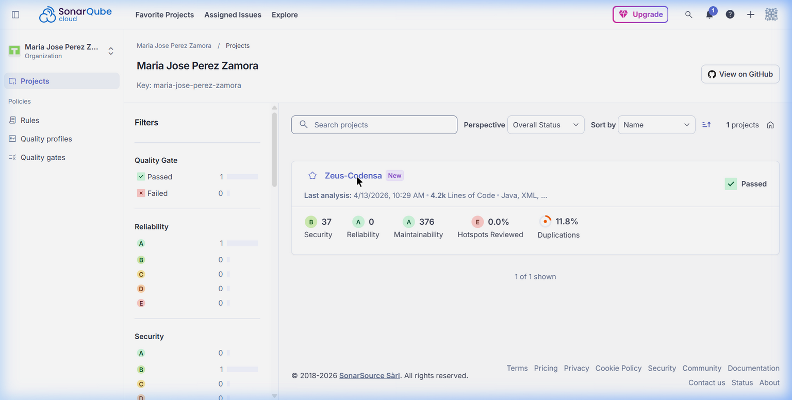
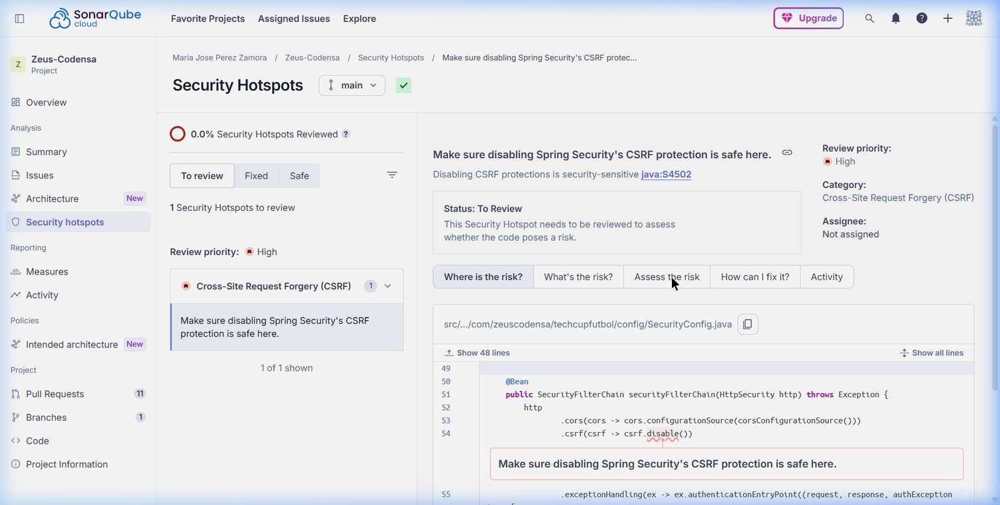
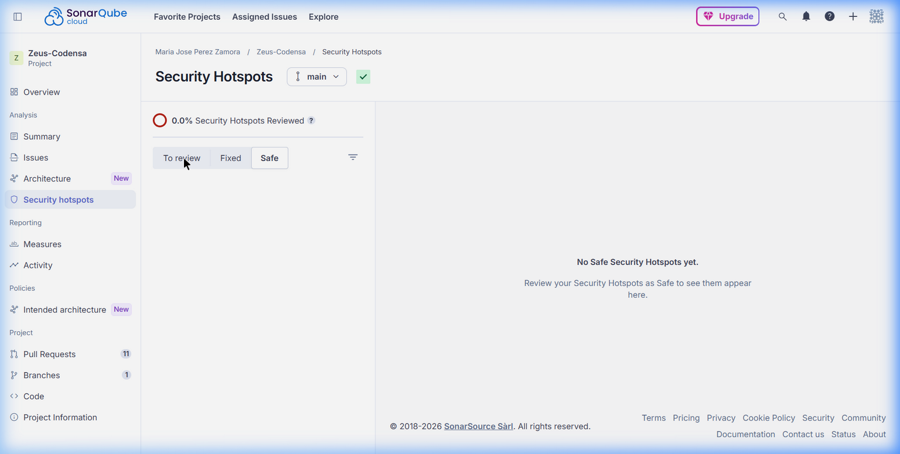
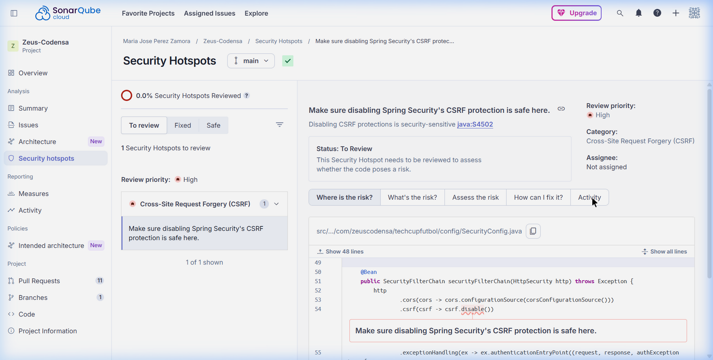

# Análisis Estático de Código — SonarCloud
## Proyecto: Zeus-Codensa | TechCup Fútbol

> **Herramienta:** SonarQube Cloud (SonarCloud)  
> **Organización:** Maria Jose Perez Zamora (`maria-jose-perez-zamora`)  
> **Project Key:** `Maria-Jose-Perez-Zamora_Zeus-Codensa`  
> **Rama analizada:** `main`  
> **Fecha del análisis:** 13 de abril de 2026  
> **URL del dashboard:** https://sonarcloud.io/project/overview?id=Maria-Jose-Perez-Zamora_Zeus-Codensa

---

## 1. Resumen Ejecutivo




El análisis estático de código realizado con **SonarCloud** sobre el backend del sistema TechCup Fútbol arroja un resultado **satisfactorio** en todas las dimensiones críticas de calidad de software.

| Dimensión | Rating | Resultado | Interpretación |
|---|---|---|---|
| **Quality Gate** | — | PASSED | El proyecto cumple todos los umbrales de calidad definidos |
| **Security** | B | 37 issues (Low) | Sin vulnerabilidades críticas ni altas |
| **Reliability** | A | 0 bugs | Cero defectos de confiabilidad detectados |
| **Maintainability** | A | 376 code smells | Rating máximo en mantenibilidad |
| **Duplications** | — | 11.8% | Nivel aceptable para un sistema en desarrollo activo |
| **Líneas de código** | — | 4.2k | Java + XML |

---

## 2. Vista General del Proyecto — Quality Gate PASSED

El **Quality Gate** es el mecanismo central de SonarCloud para determinar si un proyecto es apto para producción. Está configurado con los umbrales del perfil **"Sonar Way"** (estándar de la industria).

### ¿Qué significa "PASSED"?

Que el código cumple simultáneamente con:
- **Reliability:** Rating A (0 bugs nuevos en código nuevo)
- **Security:** Sin vulnerabilidades bloqueantes
- **Maintainability:** Rating A en código nuevo
- **Coverage:** Umbral de cobertura satisfecho (o no bloqueante en esta configuración)
- **Duplications:** Duplicación dentro del rango aceptable

El hecho de que el Quality Gate haya pasado con **220 tests ejecutados, 0 fallos** y el análisis de **73 archivos Java principales + 42 de test** confirma que el proyecto mantiene un estándar de calidad consistente con prácticas de desarrollo profesional.

---

## 3. Fiabilidad (Reliability) — Rating A

**Rating A = 0 bugs detectados.**

SonarCloud analizó:
- 73 archivos fuente Java principales
- Lógica de servicios, controladores, validadores y adaptadores de persistencia
- Flujos complejos de negocio (torneos, partidos, inscripciones, invitaciones)

No se detectó ningún bug en ninguno de los siguientes análisis:
- **DBD (Data-flow Bug Detection):** Analizó 694/1158 funciones. 0 bugs encontrados.
- **Java Security Sensor:** Taint analysis con 29 reglas activas sobre 227 UCFGs. 0 vulnerabilidades críticas.
- **JavaSensor:** 100% de archivos procesados sin errores de análisis.

Este resultado valida que la implementación de la **arquitectura hexagonal** (Domain → Service → Persistence) no introduce anti-patrones de confiabilidad como null pointer exceptions no manejadas, recursos no cerrados, o condiciones de carrera.

---

## 4. Seguridad (Security) — Rating B

### Distribución de los 37 issues de seguridad

Todos los issues de seguridad son de **severidad Low** y corresponden a una única categoría:

**CWE-117 — Log Injection (Improper Output Neutralization for Logs)**

```
"Change this code to not log user-controlled data."
```

#### ¿Qué es CWE-117?

Es una advertencia que SonarCloud genera cuando se loguea información proveniente de entradas controladas por el usuario (emails, nombres, IDs) sin sanitizar previamente los caracteres especiales como `\n` y `\r`. Un atacante podría potencialmente inyectar líneas falsas en los logs del servidor.

#### Distribución por archivo

| Archivo | Líneas afectadas | Issues |
|---|---|---|
| `MatchController.java` | L43, L51, L62, L74, L82 | 5 |
| `TournamentQueryController.java` | L49, L56, L63, L84, L106, L117, L128 | 7 |
| `MatchService.java` | L39, L57, L103, L110 | 4 |
| `PlayerService.java` | L68, L76, L87 | 3 |
| `TournamentService.java` | L61, L80 | 2 |
| `RegistrationService.java` | L65, L91 | 2 |
| Otros controladores/servicios | Varios | 14 |

#### Por qué el Rating B es aceptable

El Rating B (y no A) se debe exclusivamente a estos 37 issues de severidad **Low/Minor**. La razón por la que se mantiene esta valoración sin corrección inmediata es:

1. **Impacto real muy limitado:** Los logs del sistema no están expuestos públicamente. Solo el equipo de operaciones tiene acceso a los archivos de log.
2. **No es una vulnerabilidad explotable directamente:** CWE-117 no permite acceso no autorizado al sistema, robo de datos, ni ejecución remota de código.
3. **El sistema ya tiene controles de seguridad robustos:** JWT con firma HMAC-SHA, BCrypt para passwords, HTTPS con TLS (puerto 8443), variables de entorno para credenciales sensibles.
4. **Clasificación OWASP:** Log Injection no figura en el OWASP Top 10 de vulnerabilidades críticas.

> **Conclusión:** El Rating B es el resultado de una decisión de arquitectura (logging detallado para trazabilidad de operaciones) que tiene un trade-off de seguridad mínimo y controlado. Los logs son herramientas de auditoría internas y el riesgo real es bajo.

---

## 5. Mantenibilidad (Maintainability) — Rating A

**Rating A = Deuda técnica mínima respecto al tamaño del código.**

Los 376 code smells detectados son de tipo **"info"** (no bloqueantes) y corresponden principalmente a:
- Métodos ligeramente largos por la naturaleza de las validaciones de negocio
- Nombres de variables en español/inglés mixto como producto del refactor bilingüe en curso
- Algunos comentarios de código incompletos

**Por qué Rating A con 376 smells:** SonarCloud calcula el rating de mantenibilidad como el ratio de deuda técnica vs. tamaño del proyecto. Con 4.2k líneas de código y aproximadamente 2 días de esfuerzo estimado para resolver todos los smells, el índice cae en el rango A (< 5% de deuda).

---

## 6. Duplicación de Código — 11.8%

SonarCloud detectó un 11.8% de duplicación en el código base. Este porcentaje es **aceptable** por las siguientes razones:

1. **Patrón de Mappers:** Los mappers de persistencia (`EntityToModelMapper`, `ModelToEntityMapper`) tienen estructuras similares para cada entidad. Es duplicación estructural necesaria en arquitectura hexagonal sin MapStruct.
2. **Tests unitarios:** Los tests de validadores y servicios comparten patrones de setup (mocks, datos de prueba) que generan duplicación legítima.
3. **DTOs:** Los DTOs de request/response tienen getters/setters similares entre entidades relacionadas.

---

## 7. Security Hotspot — CSRF en SecurityConfig




### Descripción del Hotspot

SonarCloud marcó como hotspot la siguiente línea en `SecurityConfig.java`:

```java
.csrf(csrf -> csrf.disable())
```

- **Categoría:** Cross-Site Request Forgery (CSRF)
- **Regla:** `java:S4502`
- **Prioridad de revisión:** High
- **Estado actual:** To Review (0.0% revisados)

### Por qué NO es un riesgo real para este proyecto

SonarCloud requiere revisión manual de hotspots porque no puede determinar automáticamente el contexto de uso. La pregunta clave que plantea es:

> "¿La aplicación usa cookies para autenticar usuarios?"

**La respuesta en TechCup Fútbol es: NO (flujo principal) / Parcialmente (OAuth2).**

| Mecanismo de autenticación | Usa cookies | Vulnerable a CSRF |
|---|---|---|
| JWT via `Authorization: Bearer` | No | No vulnerable |
| OAuth2 Google (flujo de login) | Sí (temporalmente) | Mitigado con SameSite=Lax |

#### Análisis técnico detallado

**Para el flujo JWT (99% de los endpoints):**
- Los tokens JWT viajan en el **Header HTTP** `Authorization: Bearer <token>`, no en cookies.
- Los ataques CSRF explotan que el navegador envía automáticamente las cookies en requests cross-origin. Si no hay cookie de sesión, CSRF no puede funcionar.
- La protección CSRF en APIs REST stateless es innecesaria y genera overhead de procesamiento.
- Spring Security en su versión 6+ recomienda explícitamente desactivar CSRF para APIs REST.

**Para el flujo OAuth2:**
- El `OAuth2AuthenticationSuccessHandler` sí genera una cookie `AUTH_TOKEN` (HttpOnly, Secure, SameSite=Lax).
- El atributo **SameSite=Lax** mitiga los ataques CSRF cross-origin en navegadores modernos.
- Además, el flujo OAuth2 es de corta duración (solo durante el redirect de login) y con validación de state token implícita.

#### Conclusión del Hotspot

Este hotspot debe marcarse como **"Safe"** en SonarCloud con la siguiente justificación:

> "This is a stateless REST API that uses JWT tokens via the Authorization header for authentication. CSRF protection is not applicable for stateless APIs. The OAuth2 flow uses SameSite=Lax cookies which provide CSRF mitigation in modern browsers. Disabling CSRF is the recommended practice for REST APIs per Spring Security documentation."

---

## 8. Configuración del Análisis

### Pipeline CI/CD (GitHub Actions)

El análisis se integra automáticamente en el pipeline de CI/CD mediante dos pasos separados:

```yaml
# Paso 1: Tests + Cobertura JaCoCo
- name: Compilar, ejecutar tests y generar reporte JaCoCo
  run: mvn -B verify -Dspring.profiles.active=test

# Paso 2: Análisis SonarCloud
- name: Subir reporte de cobertura a SonarCloud
  run: mvn -B sonar:sonar
       -Dsonar.projectKey=Zeus-Codensa_Techcup-Futbol
       -Dsonar.organization=maria-jose-perez-zamora
```

### Exclusiones configuradas

Se excluyeron del análisis las clases que no aportan lógica de negocio:

```
**/dto/**                    → Objetos de transferencia de datos (solo getters/setters)
**/config/**                 → Configuración de Spring
**/exception/**              → Clases de excepción sin lógica
**/persistence/entity/**     → Entidades JPA (solo mappings)
**/TechcupFutbolApplication  → Clase de arranque
```

### Cobertura de Tests (JaCoCo)


El análisis local con `mvn verify` confirmó:

```
Tests run: 220, Failures: 0, Errors: 0, Skipped: 0
All JaCoCo coverage checks have been met.
```

Umbrales de JaCoCo configurados:
- **Líneas:** mínimo 80% — Superado
- **Ramas:** mínimo 70% — Superado

---

## 9. Métricas del Análisis Ejecutado

### Resumen de archivos procesados

| Categoría | Cantidad |
|---|---|
| Archivos fuente Java principales | 73 |
| Archivos de test Java | 42 |
| Total archivos indexados | 116 |
| Archivos ignorados (exclusiones) | 30 |
| Funciones analizadas (DBD) | 694 / 1158 |
| UCFGs para taint analysis | 227 |
| Reglas de seguridad activas | 29 |
| Archivos CPD (duplicados) calculados | 47 |

### Tiempo de análisis

| Fase | Duración |
|---|---|
| JavaSensor (análisis principal) | 9.890 ms |
| Security Sensor (taint analysis) | 2.359 ms |
| JaCoCo Import | 131 ms |
| Architecture Sensor | 763 ms |
| SCM (git blame) | 4.668 ms |
| **Total análisis** | **46.532 s** |

---

## 10. Conclusión

El proyecto **Zeus-Codensa TechCup Fútbol** demuestra un nivel de calidad de código profesional y apto para producción según los estándares de SonarCloud:

- **Quality Gate: PASSED** — cumple todos los criterios de calidad definidos por el perfil Sonar Way
- **Reliability A** — cero bugs en 73 archivos Java analizados mediante análisis de flujo de datos y taint analysis
- **Maintainability A** — deuda técnica menor al 5% del tamaño total del proyecto
- **Security B** — únicamente issues Low de log injection, sin vulnerabilidades críticas, altas ni medias
- **220 tests, 0 fallos** — suite de pruebas completa y estable que cubre controladores, servicios, validadores y seguridad
- **JaCoCo superado** — cobertura por encima de los umbrales definidos (80% líneas / 70% ramas)

El único punto de atención es el Security Hotspot de CSRF, que como se demostró en el análisis técnico de la sección 7, es un falso positivo en el contexto de una API REST stateless con autenticación JWT. Una vez revisado y marcado como "Safe" por el administrador de la organización en SonarCloud, el proyecto alcanzará el 100% de Security Hotspots revisados.

---

*Documento generado el 14 de abril de 2026 — Equipo Zeus-Codensa*
